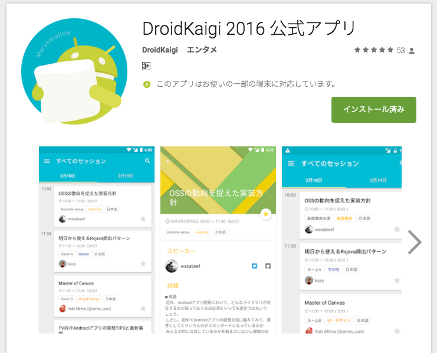

# DroidKaigiアプリをSpoonで全画面スクショしてみた


# Android Testing Bootcamp #1


# Do you like Test??


# Do you like Android Test??

# Screenshots Test

# Spoon + Espresso

## Spoon??

* “Using the application APK and instrumentation APK,Spoon runs the tests on multiple devices simultaneously.“


## Spoon??

* “Once all tests have completed a static HTML summary is generatedwith detailed information about each device and test.“


## Spoon??

* Spoon.screenshot(activity, "after_login");


## Spoon

* https://github.com/square/spoon

## Espresso

* https://code.google.com/p/android-test-kit/wiki/Espresso

## Spoon Gradle Plugin??

* “Gradle plugin for Spoon. Allows you to run spoon with almost no effort under new Android build system.“


## Spoon Gradle Plugin??

* gradle spoon

## Spoon Gradle Plugin??

```gradle
gradle spoon
```

## Spoon Gradle Plugin

* https://github.com/stanfy/spoon-gradle-plugin


## EspressoSpoonSample

* https://github.com/operando/EspressoSpoonSample


## Demo


## Demo

```gradle
gradle spoonDebugAndroidTestLarge
```

# DroidKaigi 2016 official Android app

* https://github.com/konifar/droidkaigi2016


# DroidKaigi 2016 official Android app




# Number of screens

* ??

# 結論

* そんなに難しくないよー

# Demo


# Android Test Tips


# Android Testing Support Library Release notes

* https://google.github.io/android-testing-support-library/downloads/release-notes/index.html

# Android Testing Support Library javadoc

* http://developer.android.com/reference/android/support/test/package-summary.html

# Android Testing Support Library javadoc

* なんか最新じゃ無い気がする...
* Espresso 2.2.2の内容が反映されてない疑惑...

# Release notes

* Espresso 2.2.2, Runner/Rules 0.5 (2016-02-22, silent release)


# NavigationViewActions


# NavigationViewActions

* [Espresso] NavigationViewをNavigationViewActionsで操作してみようの話
* http://qiita.com/operandoOS/items/05f650e7b7fe7e5189c2

# NavigationViewActionsSample

* https://github.com/operando/NavigationViewActionsSample

# Demo


## Sponn Settings

```gradle
spoon {
    debug true
    noAnimations true
    failIfNoDeviceConnected true
    adbTimeout 60
}
```

## 俺が考えた最強のBest Practice

### 画面表示ができればOK

画面表示までに全力を注ぐ

Espressoで細かい操作はしない


### Espressoを最小限に使う

あくまで最小限

最大限使わない

頑張らない


### createIntentパターンを使う

Activity起動に必要な情報がわかりやすい

表示したい画面のIntentが大事


```java
public class LoginSuccessActivity extends AppCompatActivity {

    private static final String EMAIL = "email";

    public static Intent createIntent(Context context, String email) {
        Intent i = new Intent(context, LoginSuccessActivity.class);
        i.putExtra(EMAIL, email);
        return i;
    }
}
```


### 実機とエミュレータを使い分ける

実機は機種依存が分かる

エミュレータは解像度が柔軟に変更できる


### 大雑把に確認する

厳密に結果を確認しない

表示するデータのこがわらない


### 全画面撮ろうとしない

アプリの規模によっては全画面無理

全画面撮れても価値があるのか疑問

撮って価値ある画面に着目する


### 前提条件が厳しい画面は潔く諦める

とにかく頑張らない


### とにかく頑張らない

気軽に楽しくがモットー

ハマるな危険 = 頑張り過ぎちゃう


## 俺が考えた最強のBest Practice

* 画面表示ができればOK 大事
* Espressoを最小限に使う
* createIntentパターンを使う 大事
* 実機とエミュレータを使い分ける 大事
* 大雑把に確認する
* 全画面撮ろうとしない
* 前提条件が厳しい画面は潔く諦める 大事
* とにかく頑張らない

## Thanks!
