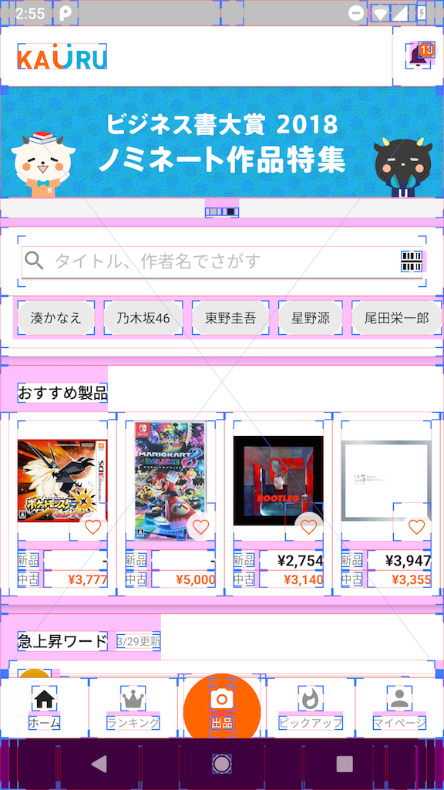
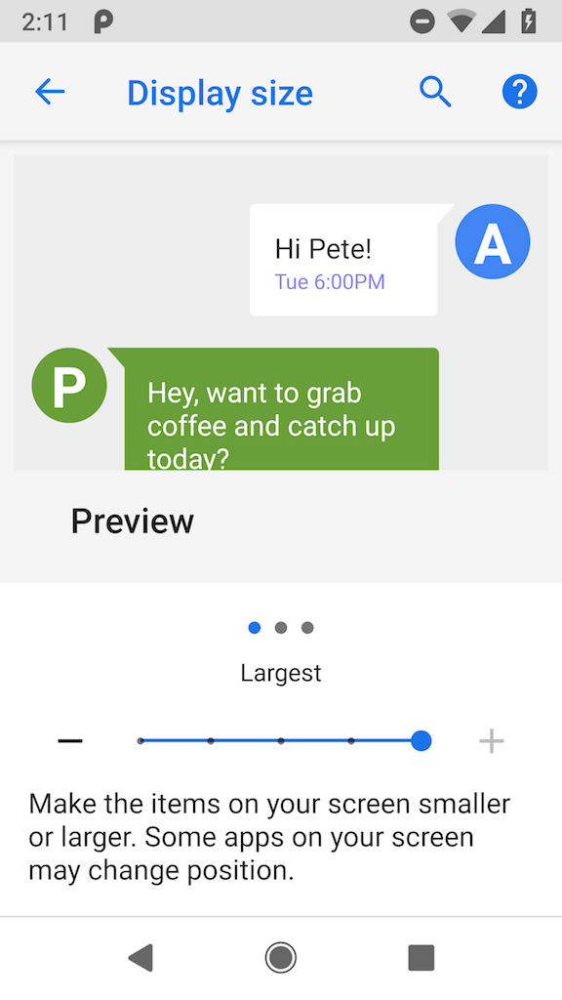
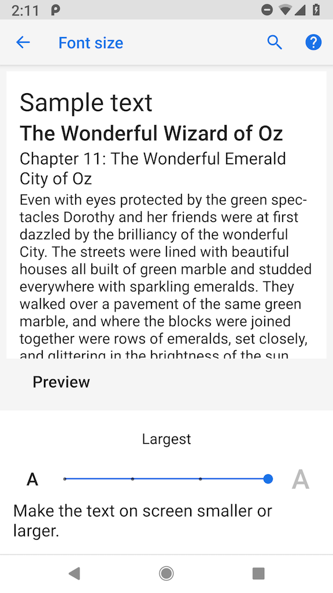

# デザインの実装を解体する技術

## スライド

* https://speakerdeck.com/operando/dezainfalseshi-zhuang-wojie-ti-suruji-shu

## (デザインを語る前に...) エンジニアなら実装できないとね！！


## デザインの実装を解体するとは？

* 色んなアプリのデザイン・レイアウトがどのように組まれているのかを調べる


## 解体するために

* 日頃から色んなアプリに触れる
* 色んなジャンルのアプリに触れる
* 解体道具をてなずける

## 話す内容は自身が作っていないアプリに
対してのアプローチ


## デザインの構造を解体する

* Show layout bounds
 * レイアウトの境界を表示する
 * レイアウトの構造がなんとなくわかる


## Show layout bounds

* 


## Show layout bounds

* adbから有効にする

```bash
adb shell setprop debug.layout true
```


## Show layout bounds

* レイアウトの構造がなんとなくわかるので便利
* でも隠れてるViewや細かい構造がわからない
* Android Device MonitorのLayout Inspectorの便利！
  * https://developer.android.com/studio/profile/monitor.html
  * https://developer.android.com/studio/debug/layout-inspector.html


## デザインの構造を解体する

* 画面の密度を変更する
* 文字のサイズを変更する
* あえてレイアウトが崩れそうなことをやってみる
* 想定外の画面や文字サイズにどう対応しているか見る


## 画面の密度・文字のサイズを変更する

* Accessibility → Font size → Largest
* Accessibility → Display size → Largest

or

* Display → Font size → Largest
* Display → Display size → Largest


## 画面の密度・文字のサイズを変更する





## 画面の密度を変更する

* adb shellからも変更できるよ！
* 設定値の上限がないので、やばい世界が見れる
* 下限値はある！ → 72


## 画面の密度を変更する

```bash
// 密度を変更する
adb shell wm density 800

// 元に戻す
adb shell wm density reset
```


## 文字のサイズを変更する

* adb shellからも変更できるよ！
* 設定値の上限がないので、やばい世界が見れる

```bash
adb shell settings put system font_scale 1.3
```


## 画面の密度・文字のサイズを変更する

* 限界はない💪


## 画面の密度・文字のサイズを変更する

* ただし壊れそう💖


## デザインの構造を解体する

* View Hierarchyをdumpする
* `adb shell dumpsys activity top`
* dumpしたい画面を開いて実行


## dumpsys activity top


## dumpsys activity top

* View.GONEとかで見れないViewもわかる
* 動的にViewが変わったりしなければ丸見え
* Viewのidがわかるのでゴニョゴニョできる
* でも細かい属性の設定がわからない


## デザインの構造を解体する

* apkを解体する
* 最終手段? 💪
* 最終兵器? 🔪


## apkを解体するツール

* apktool ⚡
  * https://ibotpeaches.github.io/Apktool/
* dex2ja 👹
  * https://github.com/pxb1988/dex2jar
* aapt 🔥
  * Android Asset Packaging Tool
  * https://elinux.org/Android_aapt


## 端末からapkをさくっと引っこ抜く

* 素晴らしい記事あります！
* dumpsys activity activitiesとpecoでゴニョゴニョして端末からapkを簡単に引っこ抜く
* https://qiita.com/operandoOS/items/6fa77037560e52d11352


## apkを解体するツール

* 解体方法は… ね？


## 解体すると手に入るもの

* リソース一式
 * レイアウトファイルも含む
* jar
 * 難読化されてないと丸見え
 * 難読化怖くないだいじょうぶ


## 目的のレイアウトファイルを調べる その1

* 前に紹介したdumpsys activity topでリソースIDの名前はわかる
* あとはIDが使用されているレイアウトを調べるだけ
* grepでもいいし、エディターの検索でもいい


## 目的のレイアウトファイルを調べる その2

* リソースIDから調べる
  * jarをゴニョゴニョして見るとリソースIDがわかる
* コード上のリソースIDを16進数に変換する
  * 元は10進数。方法は何でもいいので変換する
* 16進数化したIDで検索する
* res/values/public.xmlを検索すると見つかる


## 目的のレイアウトファイルを調べる その3

* その2と途中まで同じ
* aaptを使って調べる

```bash
aapt d resources base.apk | grep 7f0a0020
```

## 目的のレイアウトファイルを調べる その3

* 画像を貼る


## apkを解体する

* レイアウトファイルが見れるのでぱない
* 難読化されてなければCustom Viewもわかる


## デザインの構造を解体する

* 見たことないデザインの実装を依頼されたら**「このデザイン、どのアプリとかでありました？」**を聞く
* mazikore daizi
* そこから今まで紹介した解体術を使う


## まとめ

* 解体してデザインの実装の参考にする
* 気になったデザインを解体してみてね！
* 解体こわくない！


## Thanks!!

----

## おまけ


## adb shell dumpsys activity topで出るView Hierarchyの内容を理解する

* コード読め案件
* http://tools.oesf.biz/android-8.1.0_r1.0/xref/frameworks/base/core/java/android/view/View.java#5482

## adb shell settings put system font_scale周り

* 定義は以下
 * http://tools.oesf.biz/android-8.1.0_r1.0/xref/frameworks/base/core/java/android/provider/Settings.java#2996

```java
/**
 * Scaling factor for fonts, float.
 */
public static final String FONT_SCALE = "font_scale";
```

* 0以上ならいくらでも値を設定できるので上限がない
  * いくらでも文字サイズ大きくできる
  * ヤバそうｗ
  * http://tools.oesf.biz/android-8.1.0_r1.0/xref/frameworks/base/core/java/android/provider/Settings.java#3001

```java
private static final Validator FONT_SCALE_VALIDATOR = new Validator() {
    @Override
    public boolean validate(String value) {
        try {
            return Float.parseFloat(value) >= 0;
        } catch (NumberFormatException e) {
            return false;
        }
    }
};
```


## adb shell wm density周り

* http://tools.oesf.biz/android-8.1.0_r1.0/xref/frameworks/base/cmds/wm/src/com/android/commands/wm/Wm.java
  * adb shell wm実行した時に動くやーつ
* adb shell wm density XXXで動くところ
  * http://tools.oesf.biz/android-8.1.0_r1.0/xref/frameworks/base/cmds/wm/src/com/android/commands/wm/Wm.java#198
  * 72以上なら設定できそう

```java
private void runDisplayDensity() throws Exception {
    String densityStr = nextArg();
    int density;
    if (densityStr == null) {
        try {
            int initialDensity = mWm.getInitialDisplayDensity(Display.DEFAULT_DISPLAY);
            int baseDensity = mWm.getBaseDisplayDensity(Display.DEFAULT_DISPLAY);
            System.out.println("Physical density: " + initialDensity);
            if (initialDensity != baseDensity) {
                System.out.println("Override density: " + baseDensity);
            }
        } catch (RemoteException e) {
        }
        return;
    } else if ("reset".equals(densityStr)) {
        density = -1;
    } else {
        try {
            density = Integer.parseInt(densityStr);
        } catch (NumberFormatException e) {
            System.err.println("Error: bad number " + e);
            return;
        }
        if (density < 72) {
            System.err.println("Error: density must be >= 72");
            return;
        }
    }
    try {
        if (density > 0) {
            // TODO(multidisplay): For now Configuration only applies to main screen.
            mWm.setForcedDisplayDensityForUser(Display.DEFAULT_DISPLAY, density,
                    UserHandle.USER_CURRENT);
        } else {
            mWm.clearForcedDisplayDensityForUser(Display.DEFAULT_DISPLAY,
                    UserHandle.USER_CURRENT);
        }
    } catch (RemoteException e) {
    }
}
```