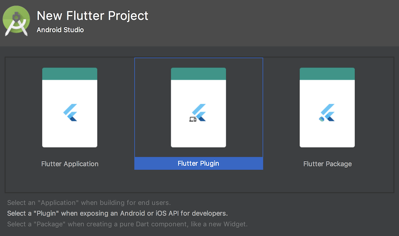
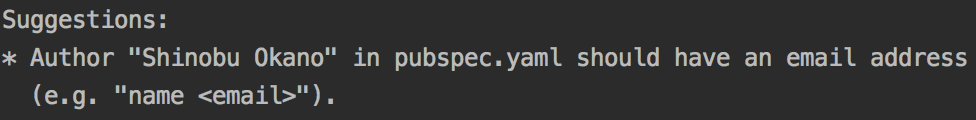

# Flutter Package & Plugin Package

## About Me

## 技術書典4で本出します！

* こうして僕らは、書籍を売るアプリを作った 2.0.1
* ぜひ買いに来てね！
* Flutter全く関係ないです！
* https://techbookfest.org/event/tbf04/circle/14710011


## これから紹介するドキュメントのURLだけ覚えて帰ってください！！それがすべてです！！


## Package & Plugin document

*  Using Packages
 * https://flutter.io/using-packages/
* Developing Packages & Plugins
 * https://flutter.io/developing-packages/
* Platform-specific code
 * https://flutter.io/platform-channels/

## What is a Packages?

* Dartはpubでパッケージ管理されてる
* Flutterのパッケージを探すところもある
* https://pub.dartlang.org/flutter
* ライブラリと思ってもらうとわかりやすい


## Flutter Package types

* FlutterではざっくりPackage typesが分かれてる
* Dart packages
* Plugin packages


## Dart packages

* Dartで書かれたライブラリ
* Flutter固有の機能が含まれているものもある

## Dart packages

* fluro
* The brightest, hippest, coolest router for Flutter.
* Flutterの機能を使ってるけど、Nativeの機能は使ってない
* https://pub.dartlang.org/packages/fluro

## Plugin packages

* Dartで書かれたライブラリ
* プラットフォーム(iOS/Android)固有の実装と組み合わせ
* Native Bridgeライブラリ的な

## Plugin packages

* shared_preferences
* Wraps NSUserDefaults (on iOS) and SharedPreferences (on Android), providing a persistent store for simple data.
* FlutterからNativeの機能・APIを呼び出す
* https://pub.dartlang.org/packages/shared_preferences


## Flutter plugins

* Flutter teamで管理されてるPlugin達
* https://github.com/flutter/plugins
* ここにあるのはPlugin packagesのみ
* Native Bridge実装の参考になるコード満載っぽい
* FirebaseのPluginが充実してる


## Native Bridgeの仕組み

* このドキュメント読んでください！
* Writing custom platform-specific code with platform channels
* https://flutter.io/platform-channels/

## Native Bridgeの仕組み


## Developing Plugin Packages

* 複雑なものじゃなけれなさくっと作れる
* 各プラットフォームのAPI知ってると楽勝
* pubへの公開も簡単


## Developing Plugin Packages

* 今日の深夜に作った
* Flutterから各プラットフォームの広告IDを取得するやーつー
* https://pub.dartlang.org/packages/advertising_id
* https://github.com/operando/advertising_id

## Create the plugin packages

* IntelliJ or Android Studioから作るのが楽



## Create the plugin packages

* コマンドからでも作れる
* NativeのコードをSwiftとKotlinで書くなら以下
* `flutter create --template=plugin -i swift -a kotlin advertising_id`

## [advertising_id.dart](https://github.com/operando/advertising_id/blob/master/lib/advertising_id.dart)

```dart
import 'dart:async';

import 'package:flutter/services.dart';

class AdvertisingId {
  static const MethodChannel _channel =
      const MethodChannel('advertising_id');

  static Future<String> get id async {
    final String id = await _channel.invokeMethod('getAdvertisingId');
    return id;
  }
}
```

## [AdvertisingIdPlugin.kt](https://github.com/operando/advertising_id/blob/master/android/src/main/kotlin/com/os/operando/advertisingid/AdvertisingIdPlugin.kt)

```kotlin
class AdvertisingIdPlugin(private val registrar: Registrar) : MethodCallHandler {

    companion object {
        @JvmStatic
        fun registerWith(registrar: Registrar) {
            val channel = MethodChannel(registrar.messenger(), "advertising_id")
            channel.setMethodCallHandler(AdvertisingIdPlugin(registrar))
        }
    }

    override fun onMethodCall(call: MethodCall, result: Result) {
        when (call.method) {
            "getAdvertisingId" -> thread {
                try {
                    result.success(AdvertisingIdClient.getAdvertisingIdInfo(registrar.context()).id)
                } catch (e: Exception) {
                    result.success("")
                }
            }
            else -> result.notImplemented()
        }
    }
}
```

## [SwiftAdvertisingIdPlugin.swift](https://github.com/operando/advertising_id/blob/master/ios/Classes/SwiftAdvertisingIdPlugin.swift)

```swift
import Flutter
import UIKit
import AdSupport

public class SwiftAdvertisingIdPlugin: NSObject, FlutterPlugin {
  public static func register(with registrar: FlutterPluginRegistrar) {
    let channel = FlutterMethodChannel(name: "advertising_id", binaryMessenger: registrar.messenger())
    let instance = SwiftAdvertisingIdPlugin()
    registrar.addMethodCallDelegate(instance, channel: channel)
  }

  public func handle(_ call: FlutterMethodCall, result: @escaping FlutterResult) {
    switch call.method {
    case "getAdvertisingId":
        var idfaString: String!
        let manager = ASIdentifierManager.shared()
        if manager.isAdvertisingTrackingEnabled {
            idfaString = manager.advertisingIdentifier.uuidString
        } else {
            idfaString = ""
        }
        result(idfaString)
    default:
        result(nil)
    }
  }
}
```

## [pubspec.yaml](https://github.com/operando/advertising_id/blob/master/pubspec.yaml)

```yaml
name: advertising_id
description: A Flutter plugin to access advertising ID.
version: 0.9.0
author: Shinobu Okano <okanoshinobu8@gmail.com>
homepage: https://github.com/operando/advertising_id

flutter:
  plugin:
    androidPackage: com.os.operando.advertisingid
    pluginClass: AdvertisingIdPlugin

dependencies:
  flutter:
    sdk: flutter

environment:
  sdk: ">=1.21.0 <3.0.0"
  flutter: ">=0.1.4"
```

## Publishing packages

* Publishのコマンドが用意されてる
* --dry-runをつけて問題ないか確認
* `flutter packages pub publish --dry-run`

## Publishing packages

* ダメなところとか親切に教えてくれるので最高☺



## Publishing packages

* pubspec.yamlの書き方はPubspec Formatのdocumentを見ると親切に書いてある
* https://www.dartlang.org/tools/pub/pubspec

## Publishing packages

* pubにpublishする
* はじめてpubにpublishする時だけGoogleの認証が走る
* `flutter packages pub publish`


## 疑問

* pubにあげたpackageって消せないのかな？🤔


## まとめ

* パッケージ管理はpubがちゃんとしてるので簡単！
* Plugin Packageは簡単に作れる・公開できる
* 各プラットフォームのAPI知ってると楽勝
* **じゃんじゃんPlugin Package作るチャンス！**

## Thanks!!