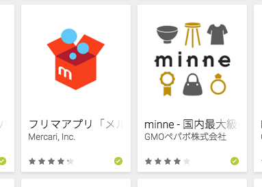

# 5分で資料作ってSlideShareにアップロードする錬金術

# A

* エムスリー x Gunosy Beer bash！


# メルカリ、2015年ベストアプリに選ばれました！！



# ありがとうございます！


# ゆるびぃ会の宣伝

* いつもエムスリーさん、お世話になってます！！
* 森さん、ありがとうございます！
* http://yuruby.connpass.com/

# ゆるびぃ会ってなんですか？？

# 女子会みたいなものです

# ※女子がいるとは言ってない

# 本題

# 用意するもの

* Terminal
* お好きなエディター
* Keynote
* ブラウザ

# まずはMarkdownで発表内容書き出す

* 好きなように書けや！！！

# githubにpushする

* https://github.com/operando/Notes
* SlideShareの書き出しがショボいから
* 文字起こししておけば、後で見る人楽

# md2keyでMarkdownからKeynoteを錬金する

* md2key
* Convert markdown to keynote
* https://github.com/k0kubun/md2key

# md2key Installしよう！！

```ruby
gem install md2key
```

# md2keyのいいところ

* AZUSA Colorsとめっちゃ相性いい！！
* formatがちゃんと決まってるから！
* gemなのでInstall簡単！！

# さて、錬金するぞ！！

# md2key README.md

# あら不思議！！資料ができちゃった！！

# 素晴らしい！！

# SlideShareにあげるぞ！！

# 日本語タイトルはサムネがうまく生成されないから気をつけろ！！

* SlideShareさん、まじぱねーっす
* どうすんだー！！
* 一枚目のスライドを画像にしてしまえ！！

# DroidKaigiやります！！

* DroidKaigi 2016
* みんな来てね！！
* https://droidkaigi.github.io/2016/
* http://droidkaigi.connpass.com/event/23512/


# Thanks！！


