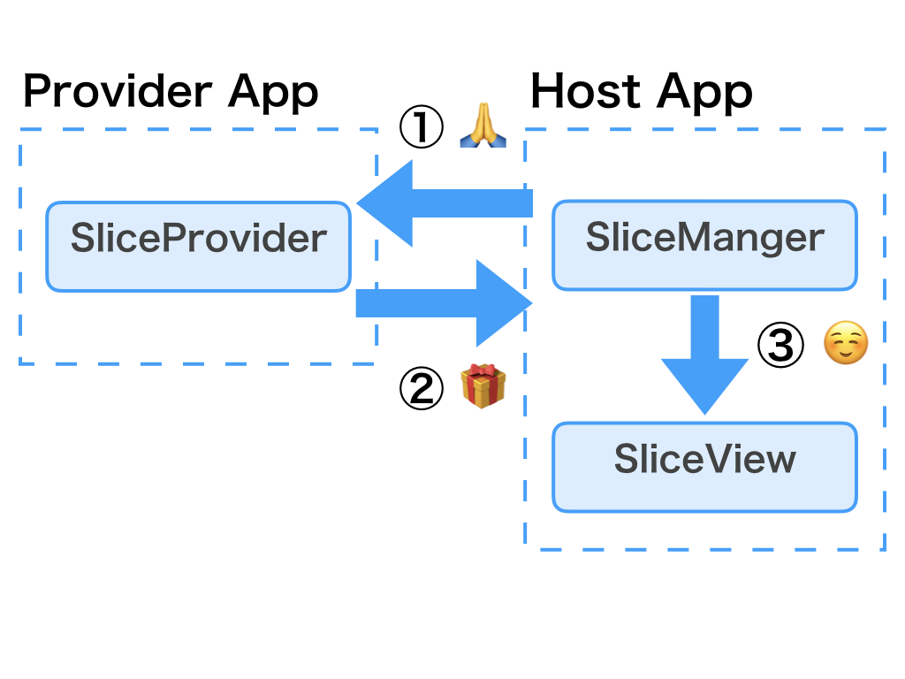

# Support Library 28.0.0 Alpha 1に触れてみる

## スライド

https://speakerdeck.com/operando/support-library-28-dot-0-0-alpha-1nihong-retemiru


## Support Library 28.0.0 Alpha 1

* https://developer.android.com/topic/libraries/support-library/revisions.html#28-0-0-alpha1


## Support Library 28.0.0 Alpha 1

* バグもあるし、API surface変わるかもなので！
* 何が起きてもびっくりしない！くらいの気持ちで試すｗ


## Important changes


## androidx: Hello World!

* package nameがandroidxになる
* Android KTXから採用され始めたやつ
* 新しいSupport Libraryからなる
* heifwriter,recyclerview-selection


## Split libraries

* split parts of support-core-ui, support-core-utils, and support-compat into smaller libraries


## Split libraries

* 依存関係を切り離すために小さいLibraryに分割する
* Google's Maven Repositoryを見るとどの単位でLibraryがあるのかわかる
* https://dl.google.com/dl/android/maven2/index.html


## Split libraries

```gradle
implementation "com.android.support:asynclayoutinflater:28.0.0-alpha1"
implementation "com.android.support:drawerlayout:28.0.0-alpha1"
implementation "com.android.support:viewpager:28.0.0-alpha1"
```


## New APIs


## recyclerview-selection

* 詳しく書いてくれたkgmyshinさんの見て！
* Support Library 28.0.0 alpha新APIのrecyclerview-selectionを使ってみた
* https://inside.dmm.com/entry/2018/03/22/recyclerview-selection


## HeifWriter

* High Efficiency Image File Format
* iOSはiOS11から採用してる
* Android Pでも公式サポート
* HeifWriterはHEIF-formatで書き込みができる
* ReadもSupport Libraryで出ること期待したい！


## HeifWriter

* https://developer.android.com/reference/androidx/heifwriter/HeifWriter.html


## New application theme

* `Theme.MaterialComponents`


## Theme.MaterialComponents

```xml
<style name="Theme.MaterialComponents" parent="Base.Theme.MaterialComponents"/>
<style name="Base.Theme.MaterialComponents" parent="Base.V14.Theme.MaterialComponents"/>
<style name="Base.V14.Theme.MaterialComponents" parent="Platform.MaterialComponents">
...
</style>
```


## Theme.MaterialComponents

* Theme.MaterialComponentsの定義
  * https://github.com/material-components/material-components-android/blob/master/lib/java/android/support/design/theme/res/values/themes.xml#L28
* Base.V14.Theme.MaterialComponentsの定義
  * https://github.com/material-components/material-components-android/blob/master/lib/java/android/support/design/theme/res/values/themes_base.xml#L33


## New components

* BottomAppBar
* Chip
* ChipGroup
* MaterialButton
* MaterialCardView


## New components

* コードはMaterial Components for Androidを参照すると良さそう
* https://github.com/material-components/material-components-android


## MaterialButton

* rippleColorとかstrokeの設定ができる
* selectorとか書かなくて良くなりそうなので素晴らしい！
* 4系でrippleColorで背景色が塗りつぶされるbugっぽいのがある


## MaterialButton

```xml
<android.support.design.button.MaterialButton
    android:layout_width="match_parent"
    android:layout_height="wrap_content"
    android:gravity="center"
    android:minHeight="48dp"
    android:text="Hello World!"
    app:cornerRadius="4dp"
    app:icon="@drawable/ic_android_black_24dp"
    app:rippleColor="#00ff00" />
```


## MaterialButton

```xml
<android.support.design.button.MaterialButton
    android:layout_width="match_parent"
    android:layout_height="wrap_content"
    android:gravity="center"
    android:minHeight="48dp"
    android:text="Hello World!"
    app:cornerRadius="4dp"
    app:icon="@drawable/ic_android_black_24dp"
    app:rippleColor="#00ff00"
    app:strokeColor="@color/colorPrimary"
    app:strokeWidth="4dp" />
```


## New components

* 紹介しなかったComponentや使い方は以下を読むと書いてあります！
* Exploring the v28 Android Design Support Library Additions
* https://medium.com/google-developer-experts/exploring-the-v28-android-design-support-library-2c96c6031ae8

## Slices

## What are Slices?

* Slices provides a framework for apps to embed templated content from other apps.


## What are Slices?

* とある解説ブログでGoogle Assistantとかに自身のアプリの情報をPlugin的に提供できるようにするAPI
という仮説が書かれてる
* Pluginを提供するのに価値があるアプリは試して
みるといいかも
* Pluginを活用して面白いアプリを作れるかも


## What are Slices?

* まだ謎に包まれてるAPI
* ただすごい興味深い
* Android P Preview 2に期待！
* まだPreview 1なのでAPIはバギー


## What are Slices?

* 他人のアプリが提供するSliceを自身のアプリに
表示することで、他人のアプリのUIや機能が
自身のアプリで使える感
* その逆もできる = 自身のアプリがSliceを提供する
* UIはある程度決まった形
* Slice Provide AppとSlice Host App


## Slice Provide App

* SliceProviderを実装する
* SliceProviderはContentProviderを継承したもの
* Format BuilderみたいなのでUI(Slice)を作る
* SliceProviderがUri or Intentに応じたSliceを返す


## Slice Host App

* SliceManagerにUri or Intentを渡しSliceProviderとbindする
* SliceProviderから返ってきたSliceをSliceViewにセットする


## Slicesの大まなか流れ




## Slices & Permission

* SliceProviderからSliceを取得するにはPermissionが必要
* Permissionに関するAPI周りがまだ謎いし、バギー
* こんな感じっぽい！の理解でOK。変わるかもしれないし


## Slices & Permission

* Permissionさえちゃんとユーザが承認すれば
どのアプリでもSliceProviderを提供してる
アプリからSliceを取得できる
* Slice Host Appが単一アプリ or 全てのアプリのSliceを取得できるようにするかどうか

## Slices & Permission


## Slices Support Library

* `com.android.support:slices-builders`
 * Slice Provide AppのためのAPI
* `com.android.support:slices-view`
 * Slice Host AppのためのAPI
* `com.android.support:slices-core`
 * Slices APIのコア


## Slice Provide Appの実装


## SliceProviderの実装

* onBindSliceでUriに応じたSliceを返す
* SliceはBuilderを使って作る
* ListBuilder, GridBuilderなどがある
* ある程度決まったUIのフォーマットで表現する

## SliceProviderの実装

```kotlin
class SampleSliceProvider : SliceProvider() {

    private var counter = 0

    override fun onCreateSliceProvider(): Boolean {
        return true
    }

    override fun onBindSlice(sliceUri: Uri): Slice {
        return when (sliceUri.path) {
            "/time" -> createTimeSlice(sliceUri)
            else -> createTimeSlice(sliceUri)
        }
    }

    private fun createTimeSlice(sliceUri: Uri): Slice = ListBuilder(context, sliceUri)
            .apply {
                counter++
                setHeader(
                        ListBuilder.HeaderBuilder(this)
                                .setTitle("What's the time now?")
                )
                addRow(
                        ListBuilder.RowBuilder(this)
                                .setTitle("It is ${SimpleDateFormat("HH:mm").format(Calendar.getInstance().time)}")
                )
                addRow(
                        ListBuilder.RowBuilder(this)
                                .setTitle("Slice has called $counter times")
                )
            }
            .build()
}
```


## SliceProviderをAndroidManifestに定義

```xml
<?xml version="1.0" encoding="utf-8"?>
<manifest>

    <application
        ... >

        <provider
            android:name=".SampleSliceProvider"
            android:authorities="com.os.operando.slice_provider"
            android:exported="true" />
    </application>
</manifest>
```

## SliceProviderをAndroidManifestに定義

* exported="true"してないと、SliceManagerでbindする時に落ちるのでつけてる
* 公開したらPermissionとか関係ないのでは？って気持ち
* ドキュメンドがまだ曖昧なのでbugかも？


## Slice Provide Appの実装

## レイアウトにSliceViewを追加

* Sliceを表示するView
* https://developer.android.com/reference/androidx/slice/widget/SliceView.html


## レイアウトにSliceViewを追加

```xml
<androidx.slice.widget.SliceView
    android:id="@+id/sliceView"
    android:layout_width="match_parent"
    android:layout_height="wrap_content" />
```

## Permissionのチェック + 認可

* ここは長いのと、bugっぽいのがあるため割愛
* 今後API変わりそうな雰囲気


## Permissionのチェック + 認可

* Slice Provide AppのSliceProviderにアクセスできるようにするために、内部実装ではContextWrapper#grantUriPermissionメソッドを使って、別パッケージでもアクセスできるように
してるっぽい？


## Sliceの表示

* SliceManagerを使用してUriを使ってSliceProviderをbindする
* SliceProviderから返ってきたSliceをSliceViewにセットする


## Sliceの表示

```kotlin
val slice = sliceManager.bindSlice(sliceUri)
sliceView.setSlice(slice)
```


## Android P Slice

* Android PではSliceManagerServiceが存在する
* つまり、System Serviceの一種


## Sliceユースケース

* 商品検索結果をSliceで返す
  * メルカリ
  * Slice Provide App側
  * 機能をPlguinとして提供するイメージ


## Sliceユースケース

* 発言などをトリガーにSliceを表示する
  * LINE、Google Assistant
  * メッセージング、アシスト
  * Slice Host App側


## Android P Slice

* Android PではSliceManagerServiceが存在する
* つまり、System Serviceの一種


## Sliceの謎

* SliceProviderを提供するアプリの把握
* SliceProviderが反応するUriのFormatの把握
* どんなアプリがどんなSliceを提供してるのか
知る方法がない気がする


## Sliceをさらに深く知る

* Android P Slices: the missing documentation — part 1 and 2
* https://blog.novoda.com/android-p-slices-missing-documentation-part-1/
* https://blog.novoda.com/android-p-slices-missing-documentation-part-2/


## Sliceをさらに深く知る

* Sample App
* https://github.com/novoda/spikes/tree/master/sliceanddice
* https://github.com/operando/Android_Support_Library_Sample


## Support Library 28.0.0 Alpha 1まとめ

* 着実にいいAPIは増えてる
* Android P Preview 2が出たらまたガラッと変わりそう
* 深く調べると新しい何かが見えてくる！かも...


## Thanks!!
