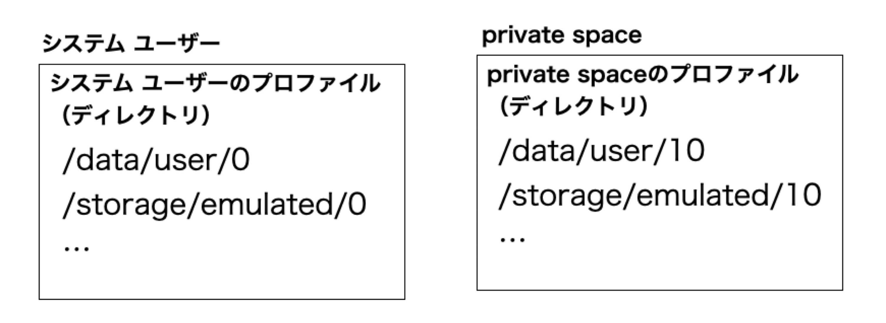
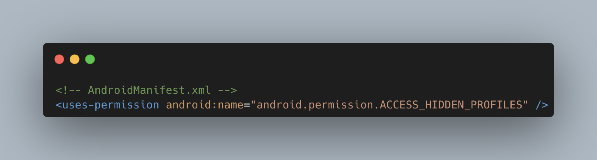
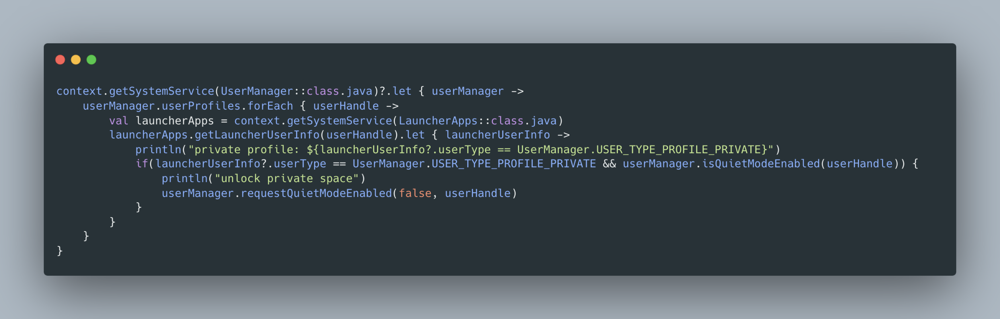
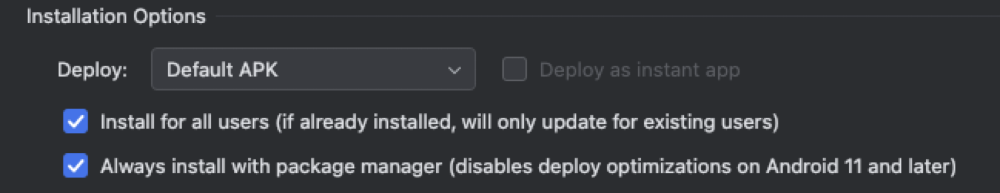
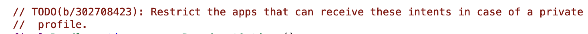

# private space

## 自己紹介

- 岡野 忍（@operandoOS）
- 株式会社LinQ / EM & Android Engineer
- 位置情報共有アプリ whooを作ってます🍩
- ポケモンGOでポケモンマスター目指してます💪

## whooの紹介

- 家族や友人同士がリアルタイムで位置情報を共有できるアプリ
- コミュニケーションを楽しむ機能も充実しています
- ほとんどの画面がDialogFragmentで実装されているちょっと変わった作り

## private space

- Android 15で実装された機能
- 追加の認証が必要な独立した空間をデバイス上に作成し、そこに
プライベートなアプリを配置することでセキュリティを確保してる
- private space用の新しいユーザーと非公開プロファイルが作成され
そこアプリやデータが保存される
- private spaceの存在を隠すことができる
- メインプロファイルとprivate spaceをシームレスに切り替えられる

## システムユーザーとprivate spaceの関係性

## システムユーザーとprivate spaceの関係性

- ぞれぞれは独立しているので、データの移動などはできない
- 一部設定はシステムユーザーのものが反映される（例えば位置情報ON/OFFとか）
- ただprivate spaceから設定値を変えることはできなさそう（例えば位置情報ON/OFFとか）
- 位置情報に関してはprivate spaceでの利用を制限できる設定がある

## **システムユーザーと**private spaceの関係性

- システム ユーザーでしかprivate spaceは作成できない
- システム ユーザーからprivate spaceのデータ（写真などのメディア）を参照する方法はある
- システム ユーザーからprivate spaceのアプリにデータを共有する方法はある
- その逆（private spaceからシステム ユーザー）はできない

## システム ユーザーからprivate spaceにあれこれする

- フレームワークの仕組みを通さないとデータ参照したり、データ共有はできない
    - PhotoPicker
    - Intent.ACTION_SEND
    - Intent.ACTION_OPEN_DOCUMENT
    - etc.
- private spaceのロックが解除されていないとできない

## アプリがprivate spaceで動作してるか判定できるのか

- できない
- private spaceがロックされてるのか、ロック解除されてるのか判断する方法はある
- ただ判定するにはデフォルトのランチャーアプリに設定されている必要がある
- ランチャーアプリ以外ではprivate spaceかどうかを判断する必要性がない設計になってる

## アプリがprivate spaceで動作してるか判定できるのか

## アプリがprivate spaceで動作してるか判定できるのか

- アプリをデフォルトのランチャーアプリにした上で実行

## private spaceがロック中か、ロック解除されてるのか判定する

- めっちゃ適用なランチャーアプリ作って、private spaceのロックを
解除するサンプル作りました
- インストールしてランチャーのデフォルトアプリにすると動作する
- https://github.com/operando/private-space-Launcher-sample

## private spaceをロックすると動作してたアプリはどうなるか

- private space上にインストールされているアプリのプロセスがKillされる
- なのでフォアグラウンドサービスなどもKillされる
- ロックしたの動いてたら困るもんね

## private spaceの存在を隠せないケース例

- adbで端末の情報あれこれ調べる
- デバイスログ
- デフォルトアプリに設定されたランチャーアプリ

## private space 公式ドキュメント

- https://developer.android.com/about/versions/15/features?hl=ja#private-space
- https://source.android.com/docs/security/features/private-space?hl=ja
- https://support.google.com/android/answer/15341885?hl=ja

## ここまでが
公式ドキュメントに
書いてあること

## private space色々検証してみてわかったこと

## BOOT_COMPLETEDとLOCKED_BOOT_COMPLETEDが
ブロードキャストされない

- private spaceをロック解除した際にこれらはブロードキャストされない
- 複数ユーザーの場合、端末起動後にユーザーを切り替えた際には
ブロードキャストされる
- ロック解除は端末起動ではないから…そうか…そうだよな…うーん…
- これ地味に困る😨

## BOOT_COMPLETEDとLOCKED_BOOT_COMPLETEDが
ブロードキャストされない

- ブロードキャストをスキップする実装になっている
- finishUserUnlockedCompletedメソッド（BOOT_COMPLETED）
  - https://cs.android.com/android/platform/superproject/+/android15-qpr1-release:frameworks/base/services/core/java/com/android/server/am/UserController.java;l=939-945
- sendLockedBootCompletedBroadcastメソッド（LOCKED_BOOT_COMPLETED）
  - https://cs.android.com/android/platform/superproject/+/android15-qpr1-release:frameworks/base/services/core/java/com/android/server/am/UserController.java;l=724-745

## なぜ困るのか

- whooはBOOT_COMPLETEDをレシーブして、位置情報を取得する
フォアグラウンドサービスを起動してる
- これが起動しないと、アプリを開くまで位置情報が取得できず
友達に位置情報を共有できない😂
- BOOT_COMPLETEDを前提とした実装はちょっと危うい

## なんとかしてロック解除後 アプリ起動なしで何かしらの処理をできないか

- WorkManagerやPush通知（FCM）などを使えばできるかも！
- 検証はしてないです🙏

## private spaceの設定画面開けない問題

- Unable to launch private space settings from 3rd-party launcher
  - https://issuetracker.google.com/issues/352276244
- Android 15でPixel Launcherだと開けるのに、 3rd-partyだと
開けない
- Android 16で開くためのメソッドが追加された
- LauncherApps#getPrivateSpaceSettingsIntent
  - https://developer.android.com/reference/android/content/pm/LauncherApps#getPrivateSpaceSettingsIntent()

## private spaceロック中に電話が来たらどうなるか

- private spaceにGoogle Meetをインストールして検証してみた
- 結果は電話の着信が通知されない
- ちゃんとprivate spaceが機能してる👍

## private spaceロック中に送られた通知はロック解除後
表示されるのか

- されない
- されないよ
- されると思ったのに…そうか…

## private spaceでアプリインストール中にロックしたらどうなるか

- インストール中は「インストール中だよ！」通知が出ている
- ロックすると、数秒後にインストール中の通知が消える
- ロック解除すると、インストールが再開される

## 音楽をバックグラウンドで再生したままロックして
ロック解除したら途中から再生されるか

- されない
- ロックするとアプリのプロセスがKillされるので、そうなるよね
- ロック解除後にアプリインストールが再開するのは、システムサービス
関連だからと推測

## private spaceでクリップボードにコピーした内容を
システムユーザーで参照できるか

- できた
- その逆もできた
- 通常のユーザー切り替えだとできない
- どうしてできるのかはClipboardManagerの実装読んでみないとわからない
- 利用する場合にちょっとだけ注意が必要な挙動

## Android Studioでビルドしたアプリをprivate spaceにインストールする

- Install for all usersにチェックすれば、private spaceにインストールできる
- How to run your app in Private Space from Android Studio
- https://medium.com/@omeronce1995/how-to-run-your-app-in-private-space-from-android-studio-1c0101ef62c5

## おまけ

- ランチャーアプリでprivate space対応したい場合はLauncher3のコード読むのがおすすめ
- https://cs.android.com/android/platform/superproject/main/+/main:packages/apps/Launcher3/
- https://cs.android.com/android/platform/superproject/main/+/main:packages/apps/Launcher3/src/com/android/launcher3/allapps/PrivateProfileManager.java
- https://cs.android.com/android/platform/superproject/main/+/main:packages/apps/Launcher3/src/com/android/launcher3/allapps/PrivateSpaceSettingsButton.java

## おまけ

- private spaceは通常のユーザー切り替えよりシームレスなので
アプリ開発時でも便利に使えそう
- 複数アカウント用意して開発・デバッグするようなアプリは便利
- 例えばwhooだと友達同士でメッセージやスタンプを送り合う機能が
あり、それのデバッグとか1端末で行えるのでよい

## おまけ

- private spaceロックするとアプリのプロセスKillされる内部実装
- ActivityManagerInternal#killForegroundAppsForUser
- https://cs.android.com/android/platform/superproject/main/+/main:frameworks/base/services/core/java/com/android/server/am/ActivityManagerService.java;l=16606-16640
- UserManagerService#setQuietModeEnabled
- https://cs.android.com/android/platform/superproject/main/+/main:frameworks/base/services/core/java/com/android/server/pm/UserManagerService.java;l=1937

## おまけ

- android.intent.action.PROFILE_UNAVAILABLEとandroid.intent.action.PROFILE_AVAILABLEを受け取るレシーバーをメインユーザーで動くアプリで設定してると、private spaceロック時、解除時に受け取れる
- 権限がないと受け取ったレシーバーから取得できるユーザーがprivate spaceのユーザーなのかは判定できない
- https://cs.android.com/android/platform/superproject/main/+/main:frameworks/base/services/core/java/com/android/server/pm/UserManagerService.java;l=1758-1759

## まとめ と 感想

- private spaceによりアプリの動作に影響するケースがある
- private spaceに対応してないランチャーアプリ多い
- 今回調査する上で内部実装も少し読んでみたけど、広範囲に影響してそうな
機能なので大変そうだなーと思った
- あーそーゆーことね private space完全に理解した

## さいご告知です🙏

- 2/12（水）19時からwhooのイベントやるので興味ある方ぜひ来てくれると嬉しいです！
- https://linq.connpass.com/event/342607/

## Thanks!!