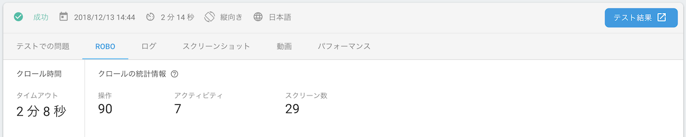
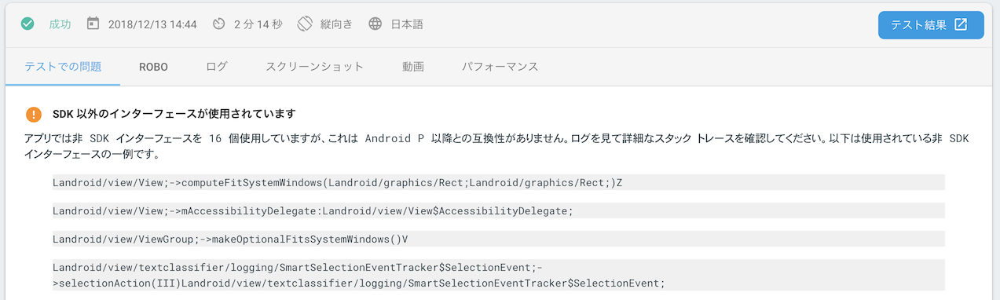
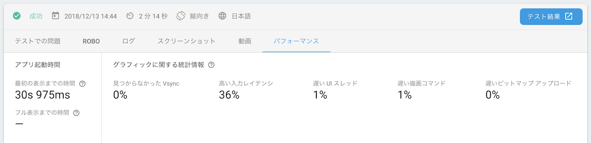
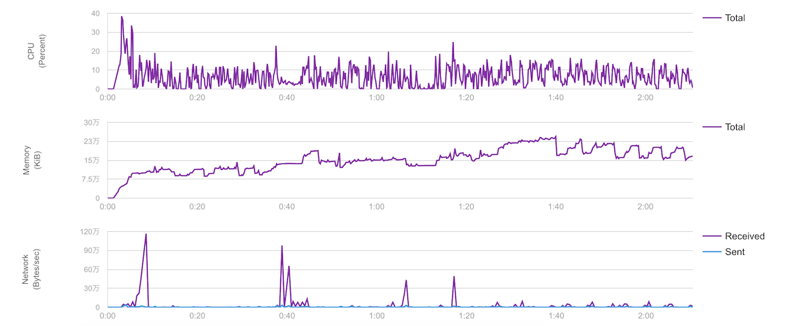
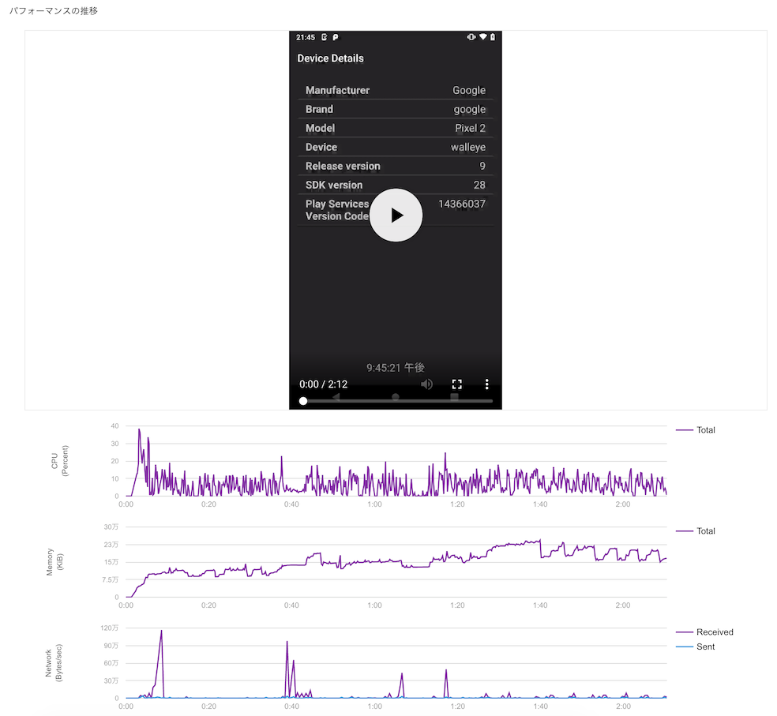
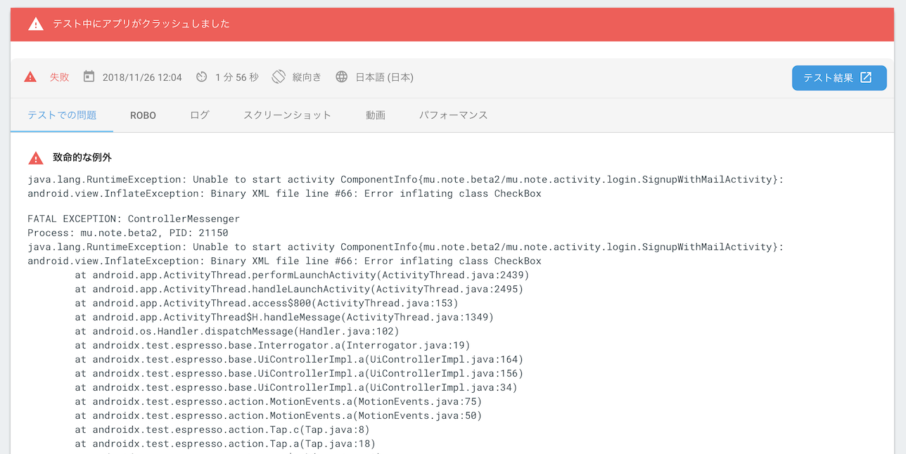
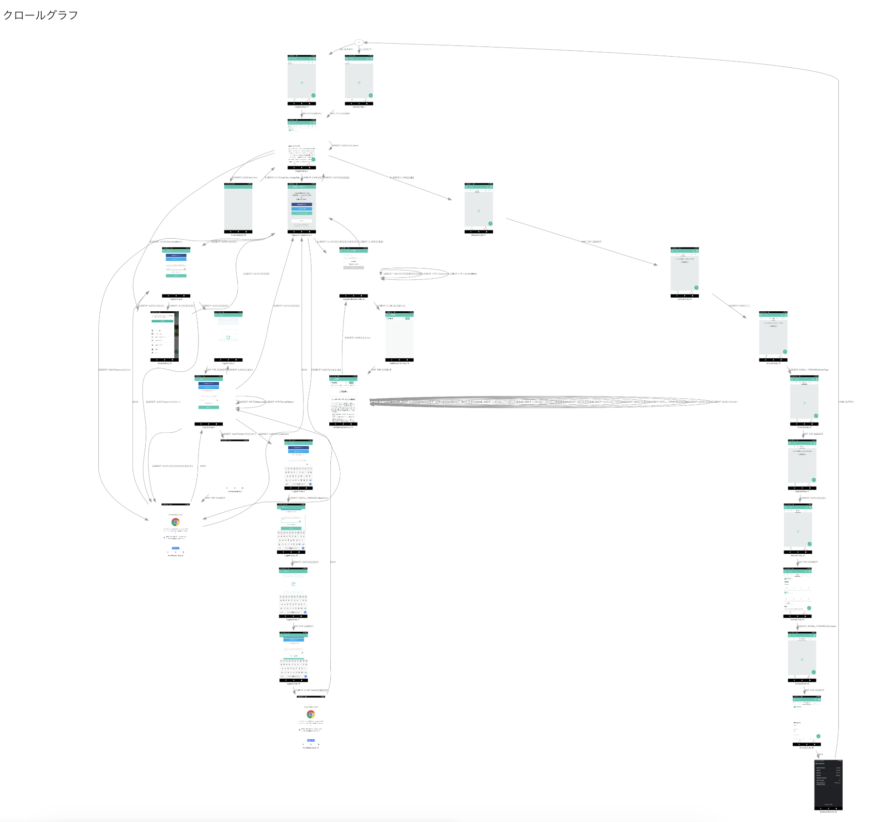

# Firebase Test LabのRobo Testいい感じ


## Firebase Test Lab

Test your app on devices hosted in a Google data center.

## Firebase Test Lab

* 仮想デバイスと物理デバイス両方用意されてる
* 今年iOSもサポートされた
* Androidだと以下のテストができる
  * Instrumentation tests
  * Robo Test
  * Game loop test


## Robo Test

Robo test analyzes the structure of your app's UI and then explores it methodically, automatically simulating user activities.

## Robo Test

* 公式ドキュメント
* https://firebase.google.com/docs/test-lab/android/robo-ux-test


## なぜ Robo Testを使い始めたのか

* 発端はQAの方が試しに実行してくれた
* 昔に使った時はあまり役にたたなかったけど、今回試してみたら良くなってた


## なぜ Robo Testを使い始めたのか

* noteはAndroid 4系までサポートしてるけど、社内にまともに動く4系端末が少ない
* リグレッションテスト的に手動で色んな画面をチェックするのが面倒
* テストコード書いてない
 * けど、なんか自動で色んな画面見てほしい


## 対応してるAPIレベル

* APIレベル 18 〜 28
* Jelly Bean MR2 〜 Pまで
* 十分そう


## Robo Testの実行に必要なもの

* テストしたいアプリのApk
* Firebase Project
* （コマンドラインから実行する場合はgcloud）


## 無料で使えます！

* Firebaseの料金プランがSparkプラン or Flameプランの場合は、ある程度無料で使えます
* ちょっと試す分には十分使えます


## お金を払えばもっと使えます！

* Firebaseの料金プランがBlazeプランの場合は、お金はかかりますが無制限で使えます
* noteはBlazeプランでFirebase test labを使ってます


## Pricing

* 料金の詳細は以下を参照
* https://firebase.google.com/docs/test-lab/android/overview#billing


## noteでのFirebase test labの先月の使用料

* 物理デバイスを2時間ちょっと使って 534円
* 仮想デバイスは数十分使って 0円
* 安い！！
* Robo Testしか使ってない


## 使う上で知っておくといいこと

* Robo Testのタイムアウト
* カスタムログイン


## Robo Testのタイムアウト

* Robo テストを実行する時間
* noteでは5分に設定してる
* まずは短くはじめて、結果を見て徐々にアプリに最適な時間を見つけるのが良さそう


## カスタムログイン

* ログインが必要な画面や機能がある場合に使う
* ログイン画面のid/passwordに入れる値を定義する
* Robo Testがログイン画面にきたら、それぞれのEditTextに定義した値を入れ、ログインしてくれる


## カスタムログイン

* これ定義しておかないと「あれ？ログイン画面 全然 突破できてない！ダメじゃん！」ってなるので、定義しておきましょう


## Demo


## Test Report


## 結果がシンプル




## non-SDK interfaces使ってるところ出してくれる

* APIレベル 28以上で動かすと出してくれる




## パフォーマンスも出してくれる




## パフォーマンスも出してくれる




## パフォーマンスも出してくれる

* Roboの操作動画とSyncしてそれぞれのグラフがどうなってるのか見れるのよい




## Robo TestでクラッシュしたらStackTrace出してくれる




## Robo TestでクラッシュしたらStackTrace出してくれる

* StackTrace見るとRobo Testはespressoを使ってアプリの操作をしてることがわかる


## テストの結果がGCSに保存される

* 操作ログのJSON
  * Robo script
  * このログを使えば、同じ操作のRobo Testができる
* Logcat
  * Robo Test実行時の端末のLogcat


## テストの結果がGCSに保存される

* Roboが操作した動画
* スクリーンショット
* クロールグラフ
  * Robo Testの操作から作成される画面遷移
  * これなかなかすごい

## クロールグラフ





## Robo Testをいつ実行してるのか

* noteではリリース前のQAを始める時に、複数バージョン、複数端末で実行してる
* どれで実行するかどかのテンプレートを作れるので、そのテンプレートを使って毎回実行すると楽
* Robo scriptはまだ使ってないので、操作は毎回ランダム操作


## 今度どうしたいか

* Releaseブランチを作ったら、CI上から自動でRobo Test実行してほしい
 * 今はgcloudかFirebase Projectポチポチで実行してる
* Robo scriptを使って、決められた操作を実行できるようにする
 * 新しい機能とか作ったらRobo scriptメンテする必要ありそうなのでどうしよう🤔
 * 運用してる方いたら知見ください🙏


## おまけ


## apkさえあれば…

* 自分たちが作ってるアプリじゃなくても
Robo Test走らせられる🤫
  * やらないでね🙅‍


## gcloudでRobo Testを実行

* gcloudをインストールする
* https://cloud.google.com/sdk/docs/downloads-interactive


## gcloudからRobo Testを実行

* こんな感じのコマンドで実行

```bash
gcloud firebase test android run \
    --type robo \
    --app <apk file path> \
    --device model=Pixel2,version=28,locale=ja_JP,orientation=portrait \
    --timeout 90s
```


## まとめ


* Robo Testはよい
* 簡単に使い始められる
* Test Reportが充実してるのも嬉しい
* CIとかにも組み込めるのよい

## Thanks!!
