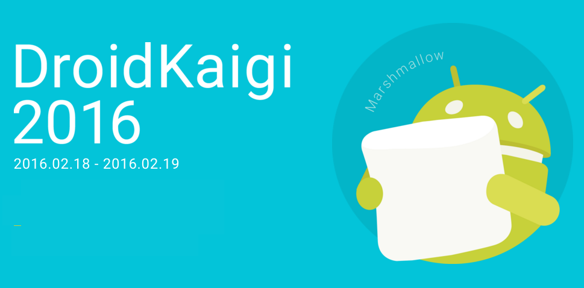

# ChromeとAndroidの過去・現在・未来

# DroidKaigi 2016

* みんな来てね！
* https://droidkaigi.github.io/2016/



# DroidKaigi 2016

* ２日間セッションします！
* Android Dev Tools Knowledge
 * 2/18 14:00-14:50
* ChromeとAndroidの過去・現在・未来
 * 2/19 16:30-17:00

# shinobu.apk #1

* パネルディスカッション・一般参加募集中！
* http://shinobu-apk.connpass.com/event/24921/

# shinobu.apk #1

* shinobu.apkは、Shinobu Okanoと愉快な仲間たちが繰り広げるファンタジーな勉強会です。
* shibuya.apkという、渋谷を中心に活動するAndroidアプリ開発者コミュニティの名前をtypoしたことによって生まれたものです。
* 真面目に言うと、有志を募ってAndroidについてパネルディスカッションをする勉強会です。
* Androidについてパネルディスカッションしよう！

# 本題

# ちなみに

# 今日の発表DroidKaigiの前フリだからね？

## Chrome??

* Web Browser developed by Google
* Blink Rendering Engine
* V8 JavaScript Engine

## Chromium??

* open-source browser project that aims to build a safer, faster, and more stable way for all Internet users to experience the web

## Chromeの技術を活用したアプリ開発

* Chrome Custom Tabs
* Web App Manifest
* Service WorkersとWeb Push Notifications


# Web App Manifest

* アプリに関連するメタデータを記述したjsonファイルをサーバに置くことで、それらの情報をBrowserなど解釈し、Service Workerなどでプッシュ通知やHomeに追加が実現できる
* https://www.w3.org/TR/appmanifest/
* メタデータを記述したjsonファイル = manifest.json
* Chrome has had support for Manifests since version 38 for Android

# Web App Manifest

* 雑に言うと、このWebページはこーゆーもんやで
* Homeに追加するならアイコンはこれ使ってくれ！
* Push使いたいで！
* アプリもあるから良かったらインストールして！
* みたいな感じ...

# あれ？Webの話じゃね？Android関係なくね？

# Native app install banner

* Webにネイティブアプリのインストールバナーを出すことができる
 * ネイティブアプリ = Android Application
* 自身がリリースしたアプリ以外のインストールバナーも出せる!
* support for Chrome 44

# Native app install banner

* You have a web app manifest file
* short_nameと144x144のpng iconをtype image/pngとして書いておく
* Your site is served over HTTPS
* The user has visited your site twice over two separate days during the course of two weeks.

# Native app install banner

* manifest.jsonに以下のような書いてあげる

```json
{
  "short_name": "Web Application Manifest Sample",
  "name": "Web Application Manifest Sample",
  "icons": [
    {
      "src": "image/ic_android_black_48dp.png",
      "sizes": "144x144",
      "type": "image/png"
    }
  ],
    "prefer_related_applications": true,
    "related_applications": [
      {
        "platform": "play",
        "id": "com.kouzoh.mercari"
      }
    ]
}
```

# DEMO Native app install banner

# Web Push Notifications

* Push API
* https://w3c.github.io/push-api/
* Notifications API
* https://notifications.spec.whatwg.org/
* Service Worker
* https://www.w3.org/TR/service-workers/

# Android Web History

# Android 1.x 〜 Android 4.3.x

* Based on the WebKit
* Google I/O 2012 - Android WebView
* https://android.googlesource.com/platform/external/chromium_org/+/kitkat-mr2-release/chrome/VERSION

# Android 4.4.x
* Chromemise Based WebView
* KK MR1 Chrome M30
* http://tools.oesf.biz/android-4.4.0_r1.0/xref/external/chromium_org/chrome/VERSION
* KK MR3 Chrome M33
* https://android.googlesource.com/platform/external/chromium_org/+/kitkat-mr2-release/chrome/VERSION
* このバージョンごとのChrome Update作業は、Lの途中までは行われていたっぽい。L PreviewならChrome M37だった

# Android 5.x 〜

* Android System WebView
* WebView apk
* In Android 5.0 (Lollipop), the WebView has moved to an APK so it can be updated seperately to the Android platform.
* https://play.google.com/store/apps/details?id=com.google.android.webview

# Chrome ✕ Android

* Chromeは今や巨大なソフトウェア
* 世界では一番使われているWeb Browser
* Androidも巨大なソフトウェア
* 世界で一番使われているMobile OS

# Chrome ✕ Android

* 世界シェアTopを誇るソフトウェアプラットフォームを握るGoogle
* Chrome OSとAndroidの統合した新しいOSのベータ版が2016年出る？みたいな噂はある
* ChromeそのものがMobileの世界に与える影響が大きくなっている(個人的実感)


a
