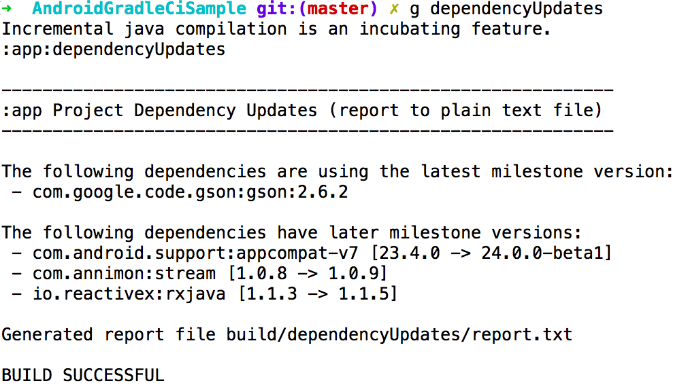
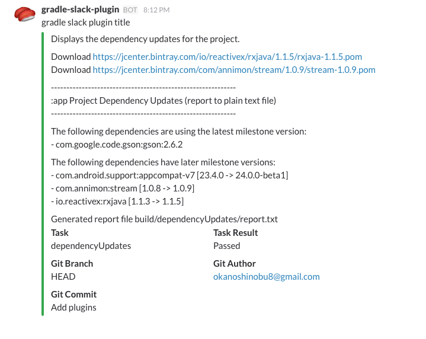
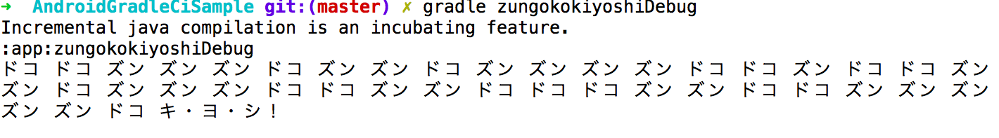
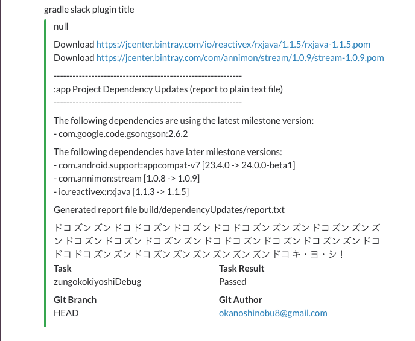

# Gradle PluginとCIと俺


## 資料

http://www.slideshare.net/shinobuokano7/gradle-pluginci-62464447

## CIしてますか？？


## CIで継続的にテストを回す？？


## そんな意識高い話じゃない!!

## [Travis CI](https://travis-ci.org/)

https://travis-ci.org/


## 俺が知ってるCIサービスの微妙なところ

* 記述してる処理が正常に終わったか or 失敗したかの通知しかこない
* ゴニョゴニョすれば細かいことはできるだろうけど難しそう...


## 何がしたかったか

* GradleのTask単位での出力結果がほしい
* その結果をSlackとかに通知してほしい
* 人力でやるのは辛いのでCIでよしなな間隔でやってほしい


## GradleからSlackに通知したい!

* できます！
* gradle-slack-pluginならね！


## [gradle-versions-plugin](https://github.com/ben-manes/gradle-versions-plugin) (original)

* https://github.com/ben-manes/gradle-versions-plugin


## [gradle-slack-plugin](https://github.com/operando/gradle-slack-plugin) (魔改造)

* https://github.com/operando/gradle-slack-plugin


## gradle-slack-plugin setting

```
slack {
    url "slack web hock url"
    // 出力を通知したいtaskを書く
    dependsOnTasks 'dependencyUpdates'
    title 'gradle slack plugin title'
    enabled true or false
}
```

## じゃ何を通知するか

* 定期的にSlackに通知して意味あるもの
* 定期的に見ておいたほうがいいもの
* 和むもの


## gradle-versions-plugin

* Gradle plugin to discover dependency updates


## gradle-versions-plugin

* gradle dependencyUpdates


## gradle-versions-plugin




## gradle-slack-plugin + gradle-versions-plugin + CI

* CI上でdependencyUpdates taskを実行
* dependencyUpdates taskの出力結果をSlackに通知する
* 簡単！！


## gradle-slack-plugin + gradle-versions-plugin + CI

* 実行するタイミングは細かく設定可能
 * Pull RequestをMerge or masterにPushされた時のみ実行とか...
 * これはCIサービス側の設定で楽にできる
* Travis CIの場合
* .travis.yml
* - if [ "$TRAVIS_BRANCH" == "master" ] && [ "$TRAVIS_PULL_REQUEST" == "false" ]; then ./gradlew dependencyUpdates; fi


## Sample

* Android Gradle Ci Sample
 * https://github.com/operando/AndroidGradleCiSample


## Demo


## こんな感じで通知くるよー




## その他に…

* [dexcount-gradle-plugin](https://github.com/KeepSafe/dexcount-gradle-plugin)でメソッド数カウントして通知する
* [gradle-android-apk-size-plugin](https://github.com/vanniktech/gradle-android-apk-size-plugin)でapkのサイズ調べて通知する
* などなど…

## 応用編

## これ覚えてますか？

## [Gradle PluginとTwitterとズン ドコ キ・ヨ・シ！](http://www.slideshare.net/shinobuokano7/gradle-plugintwitter-59637926)

* これ
* http://www.slideshare.net/shinobuokano7/gradle-plugintwitter-59637926


## [gradle-zundokokiyoshi-plugin](https://github.com/operando/gradle-zundokokiyoshi-plugin)

* https://github.com/operando/gradle-zundokokiyoshi-plugin


## gradle-zundokokiyoshi-plugin

* gradle zungokokiyoshi


## gradle-zundokokiyoshi-plugin



## どうするか

* CI上でzungokokiyoshi taskを実行
* zungokokiyoshi taskの出力結果をSlackに通知する
* 簡単！！

## Demo

## こんな感じで通知くるよー



## さらにらに...

## [gradle-twitter-plugin](https://github.com/operando/gradle-twitter-plugin)

* https://github.com/operando/gradle-twitter-plugin

## gradle-twitter-plugin

* Gradleからツイートできる素晴らしいPlugin!!

## どうするか

* CI上で....

## と思ったけど...

* なんかPluginの作りがあれであれなのでできなそう
* 作ったやつのセンスが疑われる

## 色んなGradle Plugin

* Android Dev Tools Knowledge - DroidKaigi 2016
 * http://www.slideshare.net/shinobuokano7/android-dev-tools-knowledge#33
