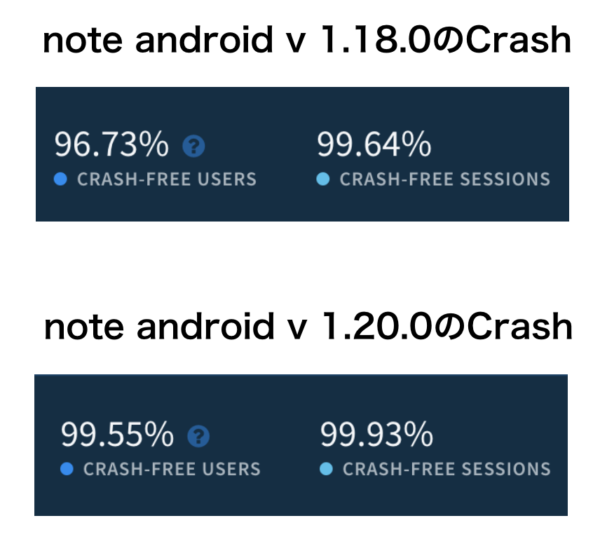
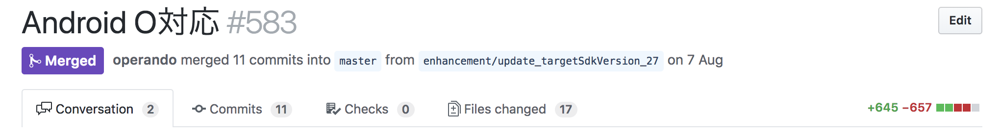
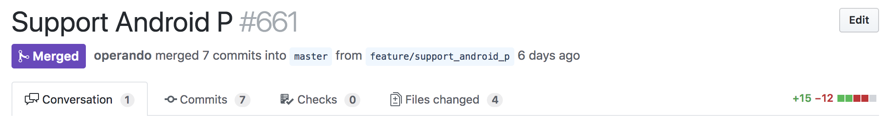
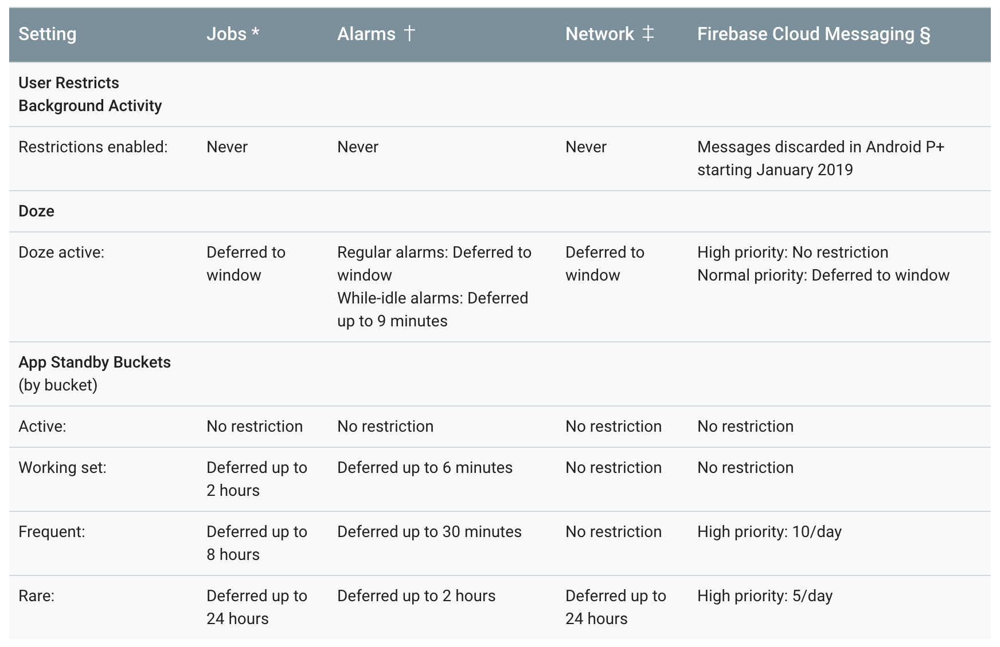

# Support Android 9 Pie

* note engineer meetup #1の発表資料の書き起こしです
* https://pieceofcake.connpass.com/event/101173/

## スライド

* https://speakerdeck.com/operando/support-android-9-pie

## note Androidチームについて

* チームと言えど、現在１人
* ~~俺が3人分になる…~~
* 成長の期待しかないチームです！

## 開発アプローチ

## note のアプリ、絶賛リニューアル中です

https://note.mu/laprasdrum/n/nab0b64f3fa4b

## とはいえ...

* リニューアルまで現行のアプリがアップデートされないことはお客様としては嬉しくない
  * アップデートがない = 改善されない + もう開発止まってるのかな？という不安
  * アプリを使ってるお客さまのこと忘れてないよ！というスタンスは大事

## iOSとAndroidで開発アプローチを変える

* iOSとAndroidでは開発観点、アプリの機能や
提供できる体験などで課題が違う
* 課題が違うならそれぞれ最適なアプローチで
やるのがベスト
* Androidはすぐリリースできるし「まずは素早く試そう」の視点

## note Androidアプリ 過去3ヶ月の取り組み

## 何をしてきたか

* 細かい使い勝手の改善 + 不具合修正
* クラッシュ率の改善
* Push通知を復活させる(涙なしには語れない)
* リファクタリング?
* いつかやらないといけないこと

## クラッシュ率の改善

## リファクタリング?

* とにかくいっぱいやりました
* ?がついてるのは、察してください...
* 現在 第二弾が終わったところで、まだまだ続きます

## いつかやらないといけないこと

* Android O対応 ✅
* Android 9 Pie対応 ✅
* GCMからFCMへの移行 🏃

## 何を意識したか

* 改善したものをなるべく早くリリースする
* むやみにコードを見ない、書かない
  * コードは読まず、アプリをとにかく触る
  * 課題を見つける時間を多く取る
* １人だからこそやるべきことは早めにやっておく

## Suppo rt Android 9 Pie

## この資料でのSupport Android 9 Pieとは

* Android 9による仕様変更で、アプリが
強制終了しないこと
* アプリのtargetSdkVersionを28にする

## そもそもなぜSupportするのか？

* 今後の Google Play でのアプリのセキュリティおよびパフォーマンスの改善について
* https://developers-jp.googleblog.com/2017/12/improving-app-security-and-performance.html

## そもそもなぜSupportするのか？

> “2018年の後半より、Playでは、新しいアプリやアプリのアップデートは最新のAndroid APIレベルをターゲットに指定することが義務づけられます。”

## そもそもなぜSupportするのか？

> “これが必須となるのは、新規アプリは2018年8月、既存アプリのアップデートは2018年11月です。”
> “2018年11月:既存のアプリのアップデートで、ターゲットAPIレベル26以降が必須になります。”

## そもそもなぜSupportするのか？

* 要は、targetSdkVersionを26にしてAndroid O対応しないとアプリのアップデートがGoogle Playで配信できなくなるよってこと

## そもそもなぜSupportするのか？

> “2019年以降:毎年、targetSdkVersionの要件が上がります。Androidの各デザートリリースの後1年以内に、新しいアプリとアプリのアップデートは、対応するAPIレベル以降にターゲットを指定することが義務づけられます。”

## つまり...

* 早めにtargetSdkVersionを上げて、新しいOSバージョン向けの対応をしておいたほうがいい
* アナウンスが出ても遠い先のことに感じて対応する気が起きない心理
* 期限が近づいて急いで対応すると事故りやすい

## 対応の難易度はアプリによってまちまち

* 使ってる機能、提供してる仕組みなどで対応の難易度が大きく変わる
* 「使っていた機能がいきなり大変なこに！？」がわりと起こる
* アプリエンジニアだけでは解決できない変更も起きる

## Android O Support Pull Request

* そこそこ対応することがあった
* コードもそこそこ書いた

## Android Pie Support Pull Request

* 対応すべきことが少なかった
* ほぼほぼコード書いてない

## まず何から始めるか

* 公式ドキュメントやAndroid Developers Blogを熟読
* targetSdkVersionに関係なく変更される動作targetSdkVersionに関係して変更される動作
それぞれを理解する

## まず何から始めるか

* Android 9関連なら以下のドキュメントが熟読対象
  * https://developer.android.com/about/versions/pie/android-9.0-changes-all
  * https://developer.android.com/about/versions/pie/android-9.0-changes-28
* Android Developers BlogにもAndroid 9向けの
解説記事がいくつかあるので、合わせて読んでおきたい

## まず何から始めるか

* 熟読して自身のアプリに影響しそうな範囲にめぼしをつける
* アプリだけで完結しない変更は早めに関係者に一声かけておく

## 個人的にやばそうと思ったAndroid 9で変更される動作

## Power management

* App standby bucketsの導入
* Battery saver improvements
* https://developer.android.com/about/versions/pie/power

## App standby buckets

* アプリの使用頻度によって、5つのpriority bucketsにアプリが振り分けられる仕組み
* priorityが低いbucketに振り分けられるほど
アプリに動作制限がかかる

## Power management

## Power management

* Battery life最適化により起こる制限のまとめ
* Power management restrictions
* https://developer.android.com/topic/performance/power/power-details

## App standby buckets

* どのbucketに割り振られるかのロジックは変更される可能性があるし、メーカー独自で変更できる？らしい
* アプリはとにかくどのbucketに割り振られても、しっかり動作するように実装する

## Restrictions on use of non-SDK interfaces

* Android P - Restrictions on non-SDK interfaces
* https://speakerdeck.com/operando/android-p-restrictions-on-non-sdk-interfaces-1?slide=4
* https://developer.android.com/about/versions/pie/restrictions-non-sdk-interfaces

## Network TLS enabled by default

* httpでの通信がデフォルト不可能になる
* iOSで言うところのATS(App Transport Security)
* 動作確認した感じだとWebViewにも適用されてる気がする

## Android 9 Supportでnoteアプリが影響しそうな範囲として洗い出したもの

* targetSdkVersionに関係なく変更される動作
 * Power management
 * Limited access to sensors in background
 * Restrictions on use of non-SDK interfaces

## Android 9 Supportでnoteアプリが影響しそうな範囲として洗い出したもの

* targetSdkVersionに関係して変更される動作
 * Foreground services
 * Network TLS enabled by default
 * Apache HTTP client deprecation

## 実際に対応が必要だった変更

* 2つだけで済んだ
* Foreground services
* Apache HTTP client deprecation

※ 対応はする必要なかったが、影響しそうな範囲として洗い出したものは、ドキュメントを読みながら動かしてみて動作確認はした

## Thanks！！
