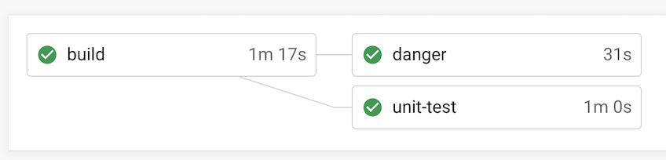

# 設定だけでCircleCIの実行時間を短縮できるかもしれない話

## CircleCIのプラン

- Performanceプランです
- ざっくりいうと従量課金モデル
- https://circleci.com/ja/pricing/

## 細かいことは気にしないでください

## 設定だけでCircleCIの実行時間を短縮させる手段

noteではそれぞれをうまく活用しています（DLC以外）

- resource_class
- cache
- parallelism
- Workflow
- DLC

## cache

- 成果物をcacheして、次のビルドにも活用する的なあれ
- 変更がなければ同じ結果が得られる場面で活用できます
- 依存関係のライブラリキャッシュとかまさにそれ
  - yarnとかBundlerとかそうですね

## resource_class

https://circleci.com/docs/ja/2.0/configuration-reference/#resource_class

- CIを実行するマシンのパワーを設定するもの
- デフォルト medium（CPU 2 メモリ 4G）
- マシンパワー上げるとビルドとか早くなる環境ではかなり役立つ
- Androidでは xlarge（CPU 8 メモリ 16G）使用
- jobごとに指定できるのもいい

## resource_class

- マシンパワー上がるので、その分従量課金のお値段も上がります
- 増し増しにしてもCPUとメモリを活用しきれない場合には不向き

## parallelism

https://circleci.com/docs/ja/2.0/configuration-reference/#parallelism

- jobの実行を複数のマシンで実行させたい場合に設定
- 主にテストの並列実行で使われる
- noteのRailsは現在 parallelism 3

## parallelism

- ある程度までは並列化すると早くなる
- 並列化しても多少の偏りは起きる
  - AマシンとBマシンで実行時間に差が出る
  - 差を調整する仕組みとして、Timing Dataが存在する
- 並列化しすぎると時間短縮と従量課金のコストが
見合わなくなる

## Running Tests in Parallel

https://circleci.com/docs/2.0/parallelism-faster-jobs/

## Workflow

https://circleci.com/docs/ja/2.0/workflows/

- jobの実行順序を定義して、いい感じにjobを
並列実行したりゴニョゴニョする
- ちょっと複雑だけど慣れてくると便利
- 逐次実行してたものを並列実行させられるようになると効果出てくる
- 状況に応じて実行するWorkflowを変えたりすると便利

## Workflow例

- ビルドして、その結果を2つのjobに共通して、jobを並列実行してる
- 逐次実行より30minくらい早くなる

## Workflow

- やりすぎ注意

## お金の話

- 個人的には気にしなくてもいいと思ってる🤭
- 無駄はダメ🙅🏽‍♂️
- お金より時間が短縮できる方が最高👍
- Time is money💰

## まとめ

- CIは生き物です、育成しましょう💪
- 「遅くね？」と思ったその時がカイゼン時期🔧
- お金をかければ早くなる…かも🙃
