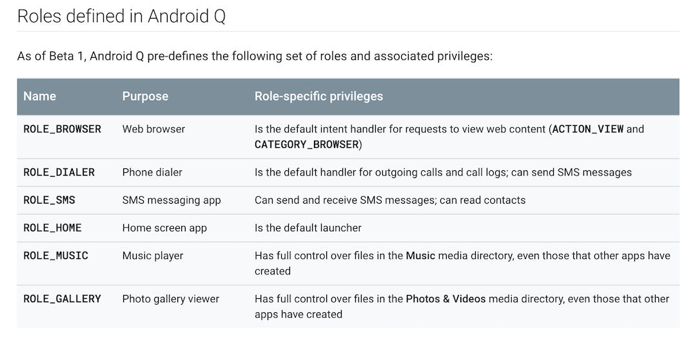
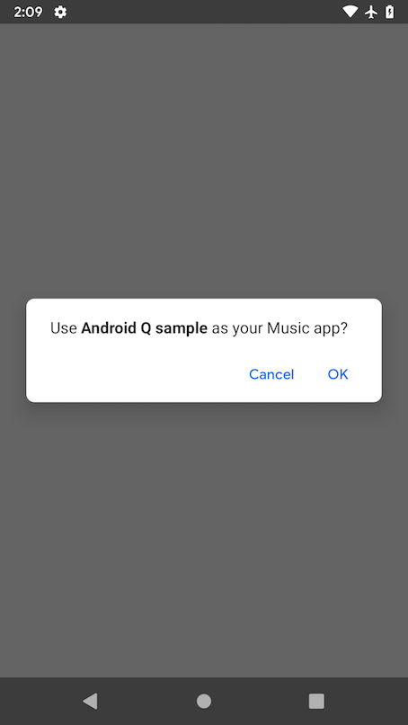
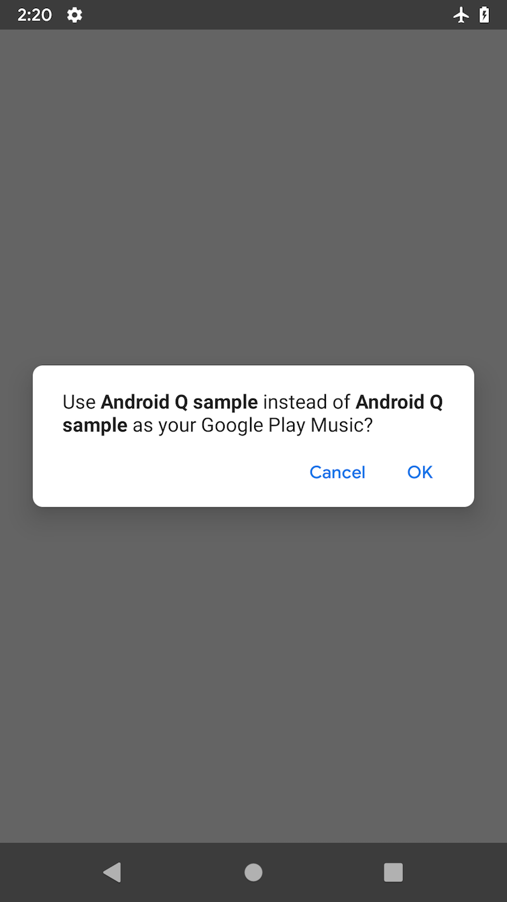
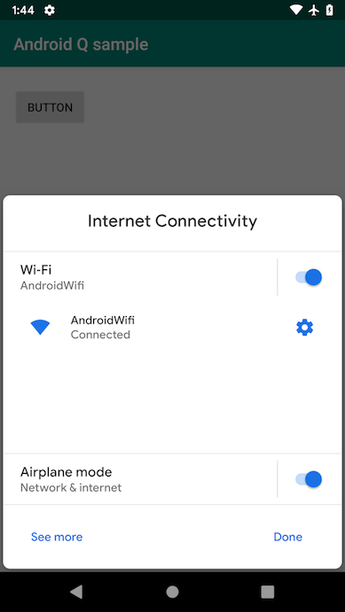

# Android Q Beta1

## 注意書き

* 本資料はBeta1時点での話です
* Beta1以降、仕様変更が行われる可能性があります
* 自身でドキュメントと挙動を確認することをおすすめします

## Android Q Beta Sample

* サンプルコード雑に書いてます
* https://github.com/operando/Android-Q-Sample


## Android Q Beta
 
* 公式ドキュメント
* https://developer.android.com/preview
* https://android-developers.googleblog.com/2019/03/introducing-android-q-beta.html


## Privacy in Android Q


* Scoped storage
* Background activity starts
* App access to device location
* Data & identifiers
* Location & network


## Scoped storage

* これが結構色々変わってる
* 外部ストレージ使わなくても、知識としてはどう変わるのかを理解しておいた方がいい
* https://developer.android.com/preview/privacy/scoped-storage

## Scoped storage

* アプリ専用の sandboxストレージに作成したファイルは他のアプリからアクセスできなくなる
* アプリ専用の sandboxストレージ
  * Context.getExternalFilesDirとかで取得できるディレクトリ
  * これまではWRITE_EXTERNAL_STORAGEパーミッションで他のアプリのファイルも扱えた？

## Scoped storage

* アプリがアンイストールされても外部ストレージに
作ったファイルを残したいならshared collectionsに保存する
* shared collections include
  * Photos & Videos
  * Music
  * Downloads


## Scoped storage

* 外部ストレージを使わないアプリは関係ない話
* 外部ストレージを使ってもアプリ専用のディレクトリだけしか使ってないアプリは影響しない話かも
* Storage Access Frameworkが便利なのでできるだけ使っていきたい気持ち


## Background activity starts

* バックグラウンドでActivityを起動することへ
の制限
* 通知のタップなどユーザ操作以外でバックグラウンドからのActivity起動ができなくなる
* 変な画面起動とかでやっている作業などが
中断されたりしなくて済むようになる


## 例えば...

* IntentServiceからstartAcitivtyするとかできなくなる
  * ユーザ操作ではないので


## App access to device location

* ユーザがバックグラウンドでの位置情報取得を許すかどうかを選択できるようになる
* バックグラウンドで位置情報を取らないアプリは影響なし


## Android Q features and APIs

* TLS 1.3 support
* Wi-Fi Direct connection API
* Roles
* Settings panels


## Roles

* ドキュメント
* https://developer.android.com/preview/features/roles


## Roles

* OSレベルでよく使われるユースケースごとにRoleを作った
* Roleを与えられたアプリはRole特有の権限が付与される
* 各RoleごとにRoleを与えられるアプリは1つ


## Roles defined in Android Q


* 


## どうしてRoleが必要だったのか？（推測）

* Android QのPrivacy周りの変更の影響を受けないような特権の仕組みが必要だったのかなーとか？
* Privacyは守りつつ、ユーザに不便をかけないためとか？
* ユーザが認めたアプリはある程度優遇される


## どうやってRoleを与えるか

* Roleを付与してほしいアプリが、「Role付与してください！」とユーザにお願いする


## Roleの付与をリクエストする

* RoleManager#createRequestRoleIntentで作成したIntentをstartActivityForResultする
* onActivityResultでリクエストの結果を受け取る


## Roleの付与をリクエストする


```java
RoleManager roleManager = getSystemService(RoleManager.class);
if (!roleManager.isRoleAvailable(RoleManager.ROLE_MUSIC)) {
  return;
}
if (roleManager.isRoleHeld(RoleManager.ROLE_MUSIC)) {
  Log.d("RoleManager", "OK");
} else {
  Intent roleRequestIntent = roleManager.createRequestRoleIntent(RoleManager.ROLE_MUSIC);
  startActivityForResult(roleRequestIntent, 2);
}
```

## Roleの付与をリクエストする


* 
* 


## Roles Tips

* adb shell dumpsys roleで定義されているRoleや、各Roleを与えられたアプリが確認できる


## adb shell dumpsys role

```
ROLE MANAGER STATE (dumpsys role):
{
  user_states={
    user_id=0
    version=-1
    packages_hash=36952A4F6A5BFC8AF7A8F8A6025837C802AA548976DB456B6222A15ECB0C37FC
    roles=[
      {
        name=android.app.role.CAR_MODE_DIALER_APP
      }
      {
        name=android.app.role.CALL_COMPANION_APP
      }
      {
        name=android.app.role.CALL_SCREENING_APP
      }
      {
        name=android.app.role.TEMPORARY_SMS_ACCESS
      }
      {
        name=android.app.role.PROXY_CALLING_APP
      }
      {
        name=android.app.role.SMS
        holders=com.google.android.apps.messaging
      }
      {
        name=android.app.role.DIALER
      }
      {
        name=android.app.role.MUSIC
        holders=com.google.android.music
      }
      {
        name=android.app.role.HOME
      }
      {
        name=android.app.role.CAR_PROJECTION
      }
      {
        name=android.app.role.GALLERY
      }
      {
        name=android.app.role.ASSISTANT
      }
      {
        name=android.app.role.EMERGENCY
        holders=com.android.emergency
      }
      {
        name=android.app.role.BROWSER
        holders=com.android.chrome
      }
    ]
  }
}
```


## Settings panels

* 特定の設定をシームレスに表示できる
* 例えば、NFCをONしたりするのに、設定アプリを開くのではなく、Settings Panelを開く
* ユーザはアプリから離脱することなく、設定を変えられる


## ネットワークのSettings panelを開く


```kotlin
val i = Intent(Settings.Panel.ACTION_INTERNET_CONNECTIVITY)
startActivityForResult(i)
```

## ネットワークのSettings panelを開く

* 


## Settings panels

* UI部分がSliceで実装されてる
* ラッパーがAndroidXで導入されるらしい


## Android Q Beta

* 他にも色んな変更が入ってるので、ぜひ公式ドキュメント読んで、コードを書いて、挙動を確かめてみてください！
* 公式ドキュメント
* https://developer.android.com/preview


## Thanks!!
