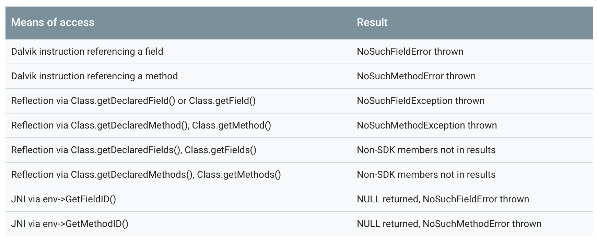
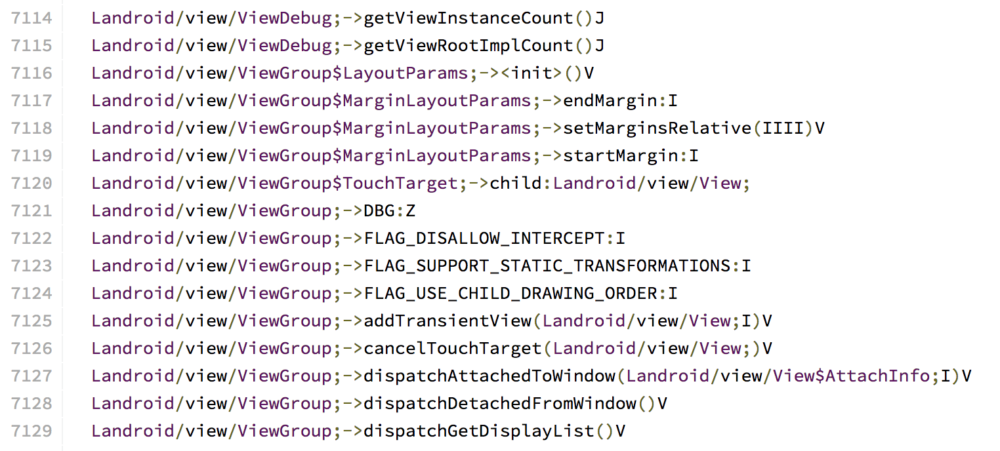
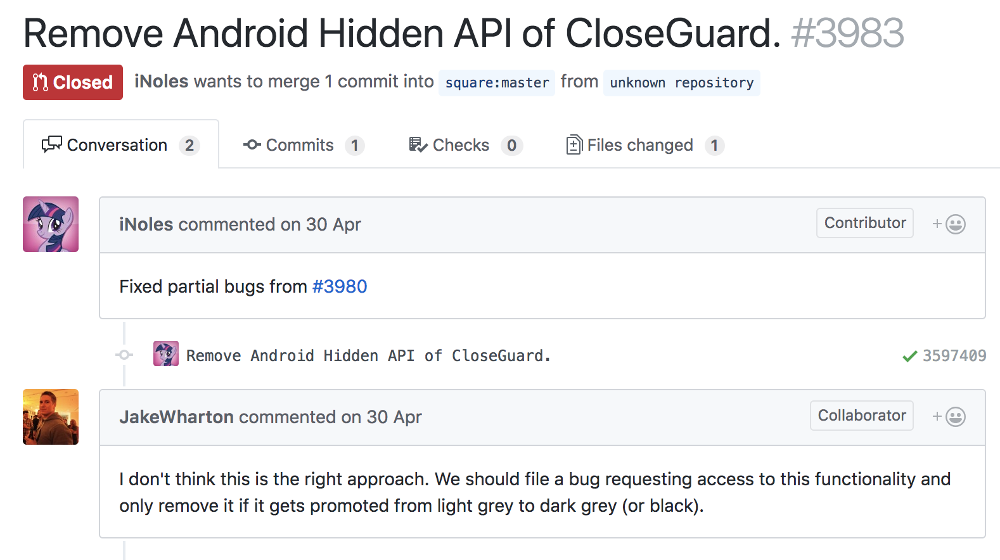
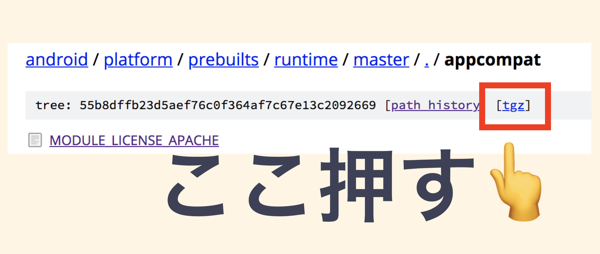
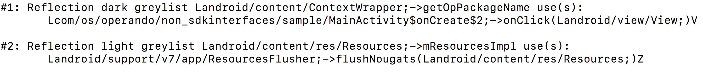
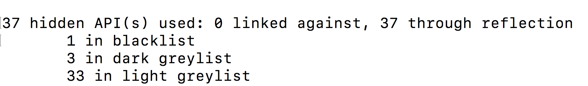

# Android P - Restrictions on non-SDK interfaces

## Slide

https://speakerdeck.com/operando/android-p-restrictions-on-non-sdk-interfaces-1

## Android P Developer Preview 3 (Beta 2)時点のドキュメントを参考に書いてます


## Restrictions on non-SDK interfaces

* Android Pから適用されるnon-SDKへの制限事項
* 雑にいうとnon-SDKにアクセスするとExceptionが起きる...場合がある！
* アプリだけではなく、ライブラリを作ってる人にも関係する話
* この制限はtargetSdkVersion関係なくAndroid Pで動作するすべてのアプリに
適用される
* 一部でtargetSdkVersionで異なる動作をする


## What are non-SDK interfaces?

* They are Java fields and methods that are not part of the official Android SDK.


## What are non-SDK interfaces?

* リフレクションを使ってアクセスするような fields and methods
* Android frameworkのSDKドキュメントに記載されていないものはnon-SDKと考えて良さそう


## What are non-SDK interfaces?

* Support LibraryなどGoogleが公式で出しているLibraryは現時点は対象外っぽい
* あくまであれらはLibraryって扱いって話かな


## つまり 🤔

* つまり、直接、リフレクション、またはJNI経由でnon-SDKを使用する場合に適用される制限ですよー

## Restrictions on non-SDK interfaces

* 直接・リフレクション、またはJNI経由でnon-SDKを使用する場合に適用される制限ですよー
* Android P未満の端末で動作するアプリではこの制限は適用されません


## Results of keeping non-SDK interfaces

* アクセス手段とそれぞれの結果は表のようになる




## Results of keeping non-SDK interfaces

* non-SDKにアクセスするとErrorやExceptionが起きたり、リフレクションしてもnullを返して存在しないfields and methodsとして扱いますよー


## すべてのnon-SDKが使えなくなるの？


## そうではない


## non-SDKは3つのリストに分けられている

* light-greylist
* dark-greylist
* blacklist


## non-SDKの各リストの違い

* 各リストごとに定義されてるnon-SDK fields and methodsが違う
* non-SDKへアクセスした時の動作が違う


## non-SDKの各リストの違い

* リストのファイルは以下のAOSPにある
* https://android.googlesource.com/platform/prebuilts/runtime/+/master/appcompat
  * hiddenapi-light-greylist.txt
  * hiddenapi-dark-greylist.txt
  * hiddenapi-blacklist.txt

## non-SDKの各リストの違い

* ファイルにはずらっとnon-SDK fields and methodsが書いてある




## light-greylist

* まだ普通にアクセスできるnon-SDKが定義されている
* 将来のバージョンでもアクセスを保証するものではない
* いつかは使えなくなるかもねって話かな


## dark-greylist

* アプリのtargetSdkVersionによって動作が異なる
* targetSdkVersionがP未満(27以下)の場合
  * まだ普通にアクセスできるnon-SDKが定義されている
  * light-greylistと同じ感じ
* targetSdkVersionがP以上(28以上)の場合
  * アクセスできないnon-SDKが定義されている
  * blacklistと同じ感じ


## blacklist

* targetSdkVersionに関係なくアクセスできないnon-SDKが定義されている
* アクセスするとExceptionが起きます
* 要はこのリストに含まれるnon-SDKは使わない方がいい！


## Sampleプロジェクト書いてみた

* https://github.com/operando/Android-P-Restrictions-on-non-SDK-interfaces-Sample


## Demo


## んで、結局なに対応したらいいの？

* 自身が作ってるアプリがnon-SDKを使ってないかチェック
* 使ってるライブラリがnon-SDKを使ってないかもチェック
* 使っていたらどのlistに含まれるnon-SDKかチェック
* dark-greylist or blacklistのnon-SDKだったら何か対応した方が良さそう
* light-greylistのnon-SDKでも対応できるならやるべき


## 対応方法

* non-SDKを使わないコードに書き直す
* 適切に例外処理して、Android P未満では
動作するコードにする
  * Android Pでは動作をあきらめる
* あきらめて踊る


## あきらめて踊る前に...

* Androidのissue trackerにFeature Requestを出す
* 使用してるnon-SDKの詳細なユースケースとか書いて出す
* 再検討はするけど、絶対に承認されるわけではない
* dark-greylistにあったものがlight-greylistになるとかはあるかも？


## あきらめて踊る前に...

* Feature Requestの出し方はドキュメントにリンクある
* https://developer.android.com/preview/restrictions-non-sdk-interfaces


## メジャーなライブラリにはissueが上がり始めてる

* okhttp reflection meet Android P DP1 non-sdk restriction
  * https://github.com/square/okhttp/issues/3980
* [ Important ] Violations on android P `Restrictions on non-SDK interfaces`
  * https://github.com/facebook/react-native/issues/19067


## ライブラリのメンテナーとしての対応

* 基本アプリの時と同じチェックを行う
* light-greylistのnon-SDKなら今すぐ対応しなくても大丈夫
* とはいえ、今後の動作は保証されるわけではないので対応できるなら対応する


## ライブラリのメンテナーとしての対応




## React Nativのissue

* [ Important ] Violations on android P `Restrictions on non-SDK interfaces`
* https://github.com/facebook/react-native/issues/19067

## React Nativのissueで触れられてる部分のコード

* リフレクションしてるね！いいね！
* けど...TextViewのmCursorDrawableResはlight-greylistに含まれるnon-SDK fieldなので今のところはPでも動く

```java
try {
    // Get the original cursor drawable resource.
    Field cursorDrawableResField = TextView.class.getDeclaredField("mCursorDrawableRes");
    cursorDrawableResField.setAccessible(true);
    int drawableResId = cursorDrawableResField.getInt(view);
    .....
} catch (NoSuchFieldException ex) {
    // Ignore errors to avoid crashing if these private fields don't exist on modified
    // or future android versions.
}
```


## ライブラリにissueをあげるなら...

* 使用されてるnon-SDKがどのlistに属するのか書く
* non-SDKを使わなくても実装できる方法があれば書く
* Androidのissue trackerにFeature Requestを出してもらうようにお願いする


## How can I enable access to non-SDK APIs?

* adbでglobal settingをいじることで、動作を変えることができます

```bash
adb shell settings put global hidden_api_policy_pre_p_apps  1
adb shell settings put global hidden_api_policy_p_apps 1
```

## How can I enable access to non-SDK APIs?

* 指定する数字の意味は以下のとおり
  * 0: Disable non-SDK API usage detection. This will also disable logging, and also break the strict mode API, detectNonSdkApiUsage(). Not recommended.
  * 1: "Just warn" - permit access to all non-SDK APIs, but keep warnings in the log. The strict mode API will keep working.
  * 2: Disallow usage of dark grey and black listed APIs.
  * 3: Disallow usage of blacklisted APIs, but allow usage of dark grey listed APIs.
* よく使うのは 1 or 2あたりかなー


## How can I enable access to non-SDK APIs?

* 動作確認終わったら設定した値は消しましょ

```
adb shell settings delete global hidden_api_policy_pre_p_apps
adb shell settings delete global hidden_api_policy_p_apps
```

## どうやってアプリでnon-SDKを使ってるのを調べるか

* StrictMode + Logcat
* static analysis tool `veridex`


## StrictMode + Logcat

* StrictMode.VmPolicy.Builder#detectNonSdkApiUsageをStrictModeのsetVmPolicyに設定する
* https://developer.android.com/reference/android/os/StrictMode.VmPolicy.Builder.html#detectNonSdkApiUsage()

```kotlin
if (Build.VERSION.SDK_INT >= Build.VERSION_CODES.P) {
    StrictMode.setVmPolicy(
            StrictMode.VmPolicy
                    .Builder()
                    .detectNonSdkApiUsage()
                    .build())
}
```

## StrictMode + Logcat

* StrictModeを設定したアプリがnon-SDKにアクセスするとLogcatにログが出る
* どのメソッドやフィールドなのかと、どのlistに属するものなのかが出て便利

```java
Accessing hidden method Landroid/gesture/Gesture;->setID(J)V (blacklist, reflection)
```

## StrictMode + Logcat

* StackTraceも表示される

```java
D/StrictMode(19092): StrictMode policy violation: android.os.strictmode.NonSdkApiUsedViolation: Landroid/widget/Toast;->mDuration:I
D/StrictMode(19092): 	at android.os.StrictMode.lambda$static$1(StrictMode.java:428)
D/StrictMode(19092): 	at android.os.-$$Lambda$StrictMode$lu9ekkHJ2HMz0jd3F8K8MnhenxQ.accept(Unknown Source:2)
D/StrictMode(19092): 	at java.lang.Class.getDeclaredField(Native Method)
D/StrictMode(19092): 	at com.os.operando.non_sdkinterfaces.sample.MainActivity$onCreate$3.onClick(MainActivity.kt:49)
D/StrictMode(19092): 	at android.view.View.performClick(View.java:6597)
D/StrictMode(19092): 	at android.view.View.performClickInternal(View.java:6574)
D/StrictMode(19092): 	at android.view.View.access$3100(View.java:778)
D/StrictMode(19092): 	at android.view.View$PerformClick.run(View.java:25883)
D/StrictMode(19092): 	at android.os.Handler.handleCallback(Handler.java:873)
D/StrictMode(19092): 	at android.os.Handler.dispatchMessage(Handler.java:99)
D/StrictMode(19092): 	at android.os.Looper.loop(Looper.java:193)
D/StrictMode(19092): 	at android.app.ActivityThread.main(ActivityThread.java:6642)
D/StrictMode(19092): 	at java.lang.reflect.Method.invoke(Native Method)
D/StrictMode(19092): 	at com.android.internal.os.RuntimeInit$MethodAndArgsCaller.run(RuntimeInit.java:493)
D/StrictMode(19092): 	at com.android.internal.os.ZygoteInit.main(ZygoteInit.java:858)
```

## static analysis tool `veridex`

* StrictModeだと実行しないとわからない
* そこで`veridex`を使う
* apkを解析して、使用してるnon-SDKを
表示してくれる

## static analysis tool `veridex`

* appcompatのディレクトリごとtgzでダウンロードする
* 以下にアクセスして、ダウンロードできる
* https://android.googlesource.com/platform/prebuilts/runtime/+/master/appcompat/



## static analysis tool `veridex`

* ダウンロードしたらPCのOSごとのzipを解凍
* あとは解析したいapkをshell scriptに指定

```bash
./appcompat.sh --dex-file=test.apk
```

## veridex - output




## veridex - output




## static analysis tool `veridex`

* 便利
* どこでnon-SDKを参照してるのかも出る
* もちろんライブラリ側でnon-SDK参照してるところもわかる
* まずは一度apkをぶっこんでみるのおすすめ


## non-SDK FAQ

* FAQがドキュメントにしっかり書いてあるので、詳しく読むと良さげ
* https://developer.android.com/preview/restrictions-non-sdk-interfaces#faq


## Are the blacklist / greylists the same on different OEM devices with the same Android versions?

* Yes OEMs can add their own apis to the blacklist, but cannot remove things from the original/AOSP black or grey lists. The CDD prevents such changes and CTS tests ensure that the Android Runtime is enforcing the list.


## 今後の開発で意識したいこと

* できるだけAndroid FrameworkのSDKはリフレクションしない
* 元々しないように気をつけた方が良かったけど、今後はさらに
* non-SDKを使うならどのlistに属するか調べる


## 思ったことなどなど

* non-SDKを使ってる場合にGoogle Play Consoleとかにも出してほしいかも
* release buildでも出してほしいかもなー
* non-SDKの各リストの内容の更新はOSアップデートのタイミングとかでされる？
  * パッチレベルでは更新なさそう
  * あるとすればOSバージョンアップくらいのアップデートの時かもね
* 使用してるライブラリがnon-SDKを使っていたらissueやPRを出そう
  * Contribute chance


## まとめ

* あきらめて踊る前にがんばろう


## 参考資料

* Restrictions on non-SDK interfaces
 * https://developer.android.com/preview/restrictions-non-sdk-interfaces
* Improving Stability by Reducing Usage of non-SDK Interfaces
 * https://android-developers.googleblog.com/2018/02/improving-stability-by-reducing-usage.html
* An Update on non-SDK restrictions in Android P
 * https://android-developers.googleblog.com/2018/06/an-update-on-non-sdk-restrictions-in.html


## Thanks！！