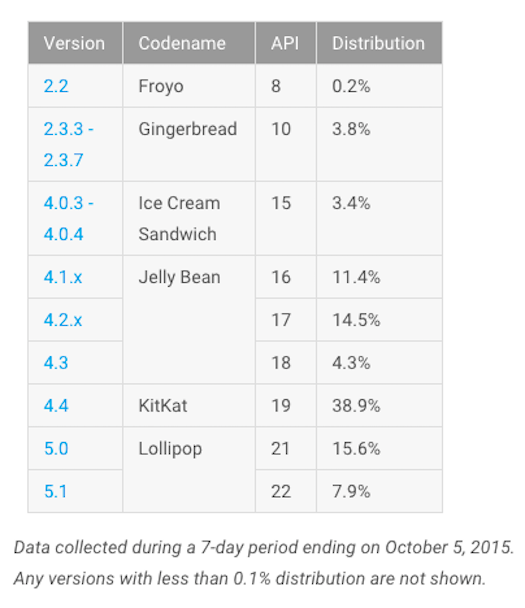
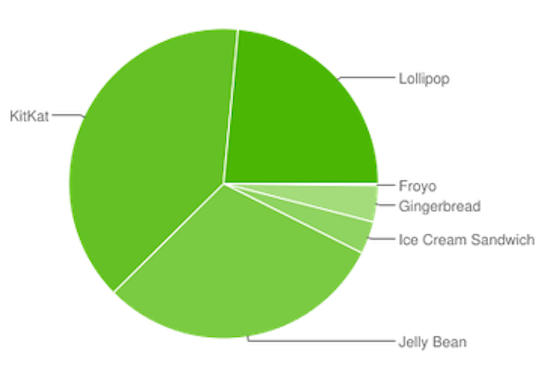
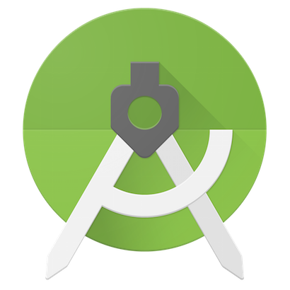

# [はじめる前に知っておきたいAndroidアプリ開発のポイント](https://schoo.jp/class/2898)

https://schoo.jp/class/2898

* Androidアプリ開発を始めるための最初の一歩
* Androidアプリ開発の種類・特徴と大まかな開発の流れ
* 時代に合ったAndroidアプリを開発する方法

この授業では未経験でAndroidアプリを作ってみたい・仕事にしたい、開発に興味がある方々を対象に、Androidアプリ開発はどんなことをするのか、始めに何から取りかかればよいか、
といったさまざまな疑問点、不安点をクリアにすることで、受講生のモチベーションを高めることを目的とした講義形式の授業です。

様々なAndroidアプリ開発から得られた経験を元に、はじめる前に知っておきたい大事なポイントを一つ一つ学んでいきましょう。

---

# Androidアプリ開発を始めるための最初の一歩

## Androidについて

* Googleが提供しているモバイル向けOS
* 最新バージョンは6.0
* アプリ開発するために使用する言語は基本的にはJava
* オープンソースなOSで、誰でも開発できる

---

## Androidのバージョンの特徴

* 各バージョンごとにコードネームが付いてる
* コードネームは、菓子の名前が付いてる
* コードネームやバージョンで呼ぶかは人それぞれ
* 最新バージョン6.0はAndroid M(Marshmallow)と呼ばれる

---

## Androidのバージョン別シェア率

* 表を見るかぎりでは、主流なバージョンは4.4(KitKat)
* 近頃シェア率が増えてるのは5.0や5.1(Lollipop)
* 今後増えるのは最近リリースされた6.0(Marshmallow)
* しかし、より広いバージョンに対応したアプリ開発が求められる

---

## Android Studio

* Androidアプリ開発をする上での統合開発環境
* 最新の安定バージョンは1.4
* EclipseよりAndroid Studioを使うべき
* Eclipse向けのサポートは今年中で終了予定

* Android Studio最速入門～効率的にコーディングするための使い方
 * http://gihyo.jp/dev/serial/01/android_studio

---

## Androidアプリ開発の初歩を学ぶ方法

* 入門書で学ぶ
 * [Android学ぶ上での書籍について - DroidKaigiの登壇者として、発表までの過程をつらつら書いていこうと思う #droidkaigi](http://hack-it-iron.hatenablog.com/entry/2015/03/22/195939)
* サンプルコード等で学ぶ
* とにかく何かアプリを作ってみる

サンプルコード等で学ぶ方法についてスポットを当てる

---

## Androidアプリ開発の初歩を学ぶ方法 -  サンプルコード等で学ぶ

* 公式に用意されているサンプルから学ぶ
 * 網羅的に学べる + 細かい仕様まで説明が書かれている部分があるのでオススメ
 * [Android Training](http://developer.android.com/training/index.html)
 * [API Guides](http://developer.android.com/guide/index.html)
 * [Google Samples](https://github.com/googlesamples?utf8=%E2%9C%93&query=android)

* mixi-inc/AndroidTraining
 * Javaの基礎からアプリ開発を行う場合オススメ
 * https://github.com/mixi-inc/AndroidTraining

---

## 日々どこから情報を仕入れているか

* Qiita tags Android http://qiita.com/tags/android

---

## エミュレータの話

エミュレータではわからないこと
ハードウェア 端末依存 デザイン / 見た目 / 操作性 処理速度 etc…

Google APIs Emulator
> Google APIs emulator をベースにしている
> Play services のメジャーリリースごとにアップデートする予定

Genymotion
https://www.genymotion.com

---

## Google Play Services

https://developers.google.com/android/

---

## Android Studio

https://developer.android.com/sdk/index.html

Android Studio最速入門～効率的にコーディングするための使い方

http://gihyo.jp/dev/serial/01/android_studio

---

## Gradle

http://gradle.org/

http://google.github.io/android-gradle-dsl/

http://google.github.io/android-gradle-dsl/current/

http://mixi-inc.github.io/AndroidTraining/introductions/1.05.how-to-build-for-gradle.html

* https://gradle.org/getting-started-android/
* http://wasabeef.jp/android-gradle/
* http://tools.android.com/tech-docs/new-build-system/user-guide

---

## Dashboards

https://developer.android.com/about/dashboards/index.html

---

## About Android

様々なデバイスで動く TV,Auto,Watch,Mobile...

---

## 余談

スマホの普及率 総務省のデータを参考に

過去1カ月のアクティブなAndroid端末は14億台
アプリストア「Google Play」のアクティブユーザーは10億人以上

http://www.itmedia.co.jp/news/articles/1509/30/news074.html

Multi-device Applications sample
https://github.com/googlesamples/android-UniversalMusicPlayer

---

# Androidアプリ開発の種類・特徴と大まかな開発の流れ

---

## 段階リリース

アルファ版またはベータ版テストと段階的公開の使用
https://support.google.com/googleplay/android-developer/answer/3131213

---

## 複数端末でのテストの話

最近機種や最近のOSには、出来る限り新しいのが出たらすぐに対応する
ダウンロードしてから、「あなた端末は非対応です」はとてもよくないの
対策として、ダウンロードできないようにする

---

## Other

評価大事

デザイナーが決めたUIをどんなViewを使用して実現するのか
* いっぱいViewある
* バージョンごとに見た目が違う
* 解像度がばらばら

技術的判断

DeployGate
https://deploygate.com/

---

## 余談

Google Play アプリ ポリシー センター
https://support.google.com/googleplay/android-developer/answer/4430948?hl=ja

Core App Quality
http://developer.android.com/distribute/essentials/quality/core.html

Essentials for a Successful App
http://developer.android.com/distribute/essentials/index.html

---

# 時代に合ったAndroidアプリを開発する方法

---

* PCサイトの方が便利
→そう要らせないようなアプリにする

* ブラウザとアプリの体験が全く同じ
→そうしない。mobileに最適化したものを

「アプリらしい」体験の例
* オフラインで使える
* Webサイトより早く目的の情報にたどりつける
* 動作や表示が軽快で操作感が気持ち良い

とにかく色んなアプリを見てみる
* google playの最近のアプリやTopアプリ
* JPだけでなく、他の国のStoreも見る

---

## Material Design

Top
https://design.google.com/

Introduction
https://www.google.com/design/spec/material-design/introduction.html

Material icons

https://www.google.com/design/icons/

---

# TODO

* 時間内で全て書くことは難しいので、よくある質問等に対する答えをどこかにまとめる
 * 話す内容は重視したい部分だけに絞る

* 入門書で学ぶことの難しさをブログに追記 or 別記事で書く。Mが出てるとかASの更新が早いとか・・・

# 初めてやる時に知りたいこと

* その分野でどんなものが流行っているのか
* どこから情報を得ているのか
* 開発環境について
* 基礎の勉強法・出だし。どこにいい教材があるかどうか

# おまけ

---

## OSSの力を借りる

[iosched](https://github.com/google/iosched)

[santa-tracker-android](https://github.com/google/santa-tracker-android)

[Rebuild](https://github.com/rejasupotaro/Rebuild)

[WordPress-Android](https://github.com/wordpress-mobile/WordPress-Android)

[wordpress-mobile](https://github.com/wordpress-mobile)

---
