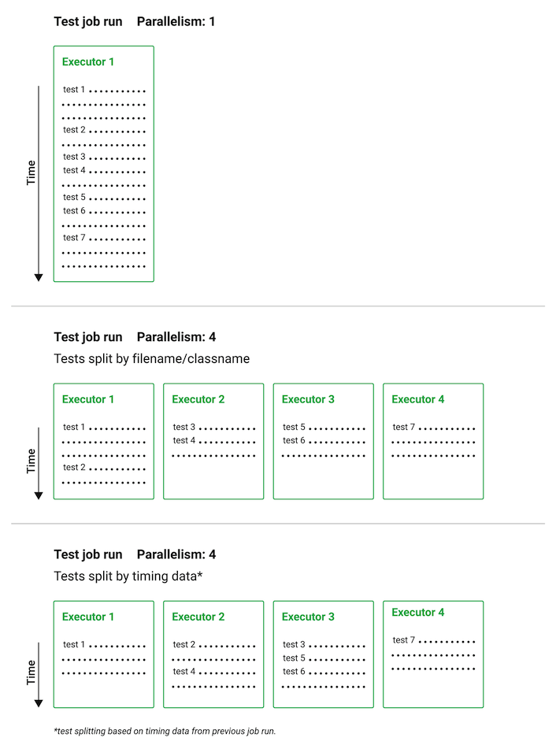
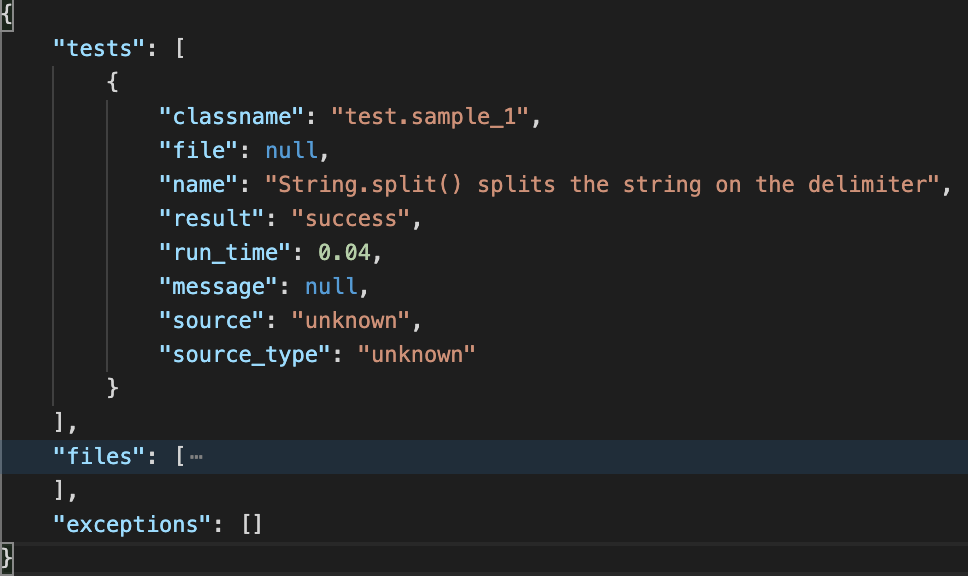

# CircleCIでtiming dataに基づいたテスト分割をDartで利用できるようにした話

## timing dataの話をする上ので前提知識

## CircleCIのテストメタデータ

- テスト結果が記載されたファイルのこと（雑）
- テストメタデータを活用するとTest Insightsなどが利用できる
- timing dataはテストメタデータから生成される

## CircleCIのテストメタデータ

- Collecting test data
- https://circleci.com/docs/2.0/collect-test-data/

## CircleCIでテストメタデータを保存する

- store_test_resultsステップでテスト結果（テストメタデータ）を保存する
- https://circleci.com/docs/ja/2.0/configuration-reference/#storetestresults

## CircleCIでテストメタデータを保存する

```yaml
- store_test_results:
    path: test-results
```

## CircleCIのテストメタデータ フォーマット

- CircleCIでテスト結果がテストメタデータと認識されるフォーマットは以下
  - JUnit XML
  - Cucumber JSON
- 多くの言語ライブラリでサポートしているのはJUnit XML
- 本資料でもJUnit XMLを扱います

## JUnit XML Schema

- https://github.com/windyroad/JUnit-Schema
- https://github.com/sj26/rspec_junit_formatter/blob/main/lib/rspec_junit_formatter.rb#L9-L11
- http://windyroad.org/dl/Open%20Source/JUnit.xsd

## CircleCIのテスト分割と並列実行

- 1つの実行環境（Executor）で全テストを実行するとCIの実行時間が長くなる
- CircleCIにはテストを複数のExecutorに分割させるためのコマンドがある
- コマンドで分割したテストを複数のExecutorで並列実行させることにより全テスト実行が早くなり、CIの実行時間も短くなる

## CircleCIのテスト分割と並列実行

- Running Tests in Parallel
- https://circleci.com/docs/2.0/parallelism-faster-jobs/

## CircleCIのテスト分割と並列実行



- 公式ドキュメントの図をお借りして説明するとこんな感じ
- 一番下がtiming dataに基づいたパターンの説明

## テスト分割

- 分割の仕方によって全体のテスト実行時間に影響する
- 適当に分割して並列実行させると環境ごとに実行時間にばらつきが出る
- 可能なかぎり環境ごとの実行時間のばらつきが小さくなるように分割するのがよい✨

## 最適なテスト分割

- 各テストケースの実行にかかる時間を計測する
- 計測した時間を利用し全体のテスト時間が短くなるよういい感じのアルゴリズムでいい感じに分割する
- 「いい感じ」が大事😊

## 最適なテスト分割とは

- circleci tests split --split-by=timingsについて調べた・自作してみた
- https://hoshinotsuyoshi.com/post/circleci_tests_split/

## CircleCIのテスト分割

- 以下の分割方法をサポートしている
  - タイミングデータ（timing data）
  - ファイル名・クラス名
  - ファイルサイズ
- CircleCIはtiming dataによる分割が最良の方法としてる

## CircleCIのtiming data

- 各テストケースの実行時間が記載されているJSONファイル
- テストメタデータを元にCircleCIがtiming dataを生成する
- timing dataの内容は確認できる

## CircleCIのtiming data

- 各テストケースの結果には、クラス名とファイル名などが記載されていることをCircleCIは期待している
- 各テストファイルのテスト実行にかかる時間がわかるデータ構造
- デフォルトの分割方法が、ファイル名に基づいた分割なので上記が必要
- テストメタデータにそれらの情報が記載されていないとtiming dataを利用しても思ったとおりにテスト分割が実行されない

## timing dataを利用してテスト分割して実行する例（rspec）

```ruby
circleci tests glob "test/**/*.rb" | circleci tests split --split-by=timings > /tmp/tests-to-run
bundle exec rspec $(cat /tmp/tests-to-run)
``` 

## timing dataを利用してテスト分割して実行する例（rspec）

- circleci tests splitでテストファイルの一覧取得
- --split-by=timingsでtiming dataを利用し実行環境ごとにテスト分割を行うように指定
- bundle exec rspecへ実行環境ごとに分割されたテストを実行するように指定

## Dartのtestについて

## Why Dart test?

- 私が所属する会社 10Xで作っているサービス StailerではAPI実装にサーバーサイドDartを使用
- サーバーサイドDartではCIにCircleCIを利用している
- Dartでテストを書く場合「test」パッケージがメジャー
- https://pub.dev/packages/test

## Dart sharding tests

- testパッケージにはテスト分割する機能がある！！
- 現在 10Xではtestの機能を使ってCircleCI上でテストを分割・並列実行している
- しかし、この分割方法は各テストケースの実行時間などを元にテスト分割されるわけではない
- そのためExecutorごとに実行時間のばらつきが大きいのが課題

## Dart sharding tests

```ruby
dart test --total-shards 3 --shard-index 0 path/to/test.dart
dart test --total-shards 3 --shard-index 1 path/to/test.dart
dart test --total-shards 3 --shard-index 2 path/to/test.dart
```

## Dart sharding tests

- testパッケージのテスト分割の実装
- https://github.com/dart-lang/test/blob/2afbff8cc059b37b4b1a69fc2ddffc53290e4780/pkgs/test_core/lib/src/runner.dart#L428-L443


## Dart testsでCircleCIのtiming dataを利用してもっといい感じにテスト分割・並列実行したい！と思ったわけで…

## Dart testの結果をJunit XMLで出力する

- Dart testはテスト結果をJSON出力する機能がある
- https://github.com/dart-lang/test/blob/master/pkgs/test/doc/json_reporter.md
- そのJSON出力された結果をJunit XMLに変換するツールがある
- https://github.com/TOPdesk/dart-junitreport
- これを使ってDart testのテスト結果をJunit XMLで出力する

## 出力したJunit XMLをテストメタデータとしてCircleCIに認識させる

- store_test_resultsステップにJunit XMLを出力したディレクトリを指定する
- これでテスト結果のJunit XMLがCircleCIにテストメタデータとして認識される
- 認識したテストメタデータを元にCircleCIがtiming dataを生成する

## テスト実行のコマンドを書き換える

- timing dataを利用してテスト分割を行い、分割したファイルのみでテスト実行するようにコマンドを書き換える

```ruby
TESTFILES=$(circleci tests glob "test/**/*_test.dart" | circleci tests split --split-by=timings)
dart run test ${TESTFILES} --file-reporter json:test_results/tests_report.json --reporter expanded
```


## よし、これで完璧✨✨✨✨


## では...なかった...💥💥💥💥


## 何が起きたか...😨

- "No timing found for <ファイル名>"というメッセージが出た
- テストファイルに対するtiming dataが存在しないぜ！って言ってる
- timing dataのファイルは生成されていたが、何かしらの原因でうまく利用されていないので、最適なテスト分割が行えていない

### timing dataのファイルを確認する方法

```ruby
cat ${CIRCLE_INTERNAL_TASK_DATA}/circle-test-results/results.json
```

## 何がダメだったか...😱

- timing dataを確認してみてわかったのが、各テストケースがどのテストファイルに記載されているのかを示すfile keyの値がnullだった



## 何がダメだったか...まとめると...😱

- 各テストケースの実行時間などは記載されているが各テストケースがどのファイルに記載されているのかを示す値がnullなので、テストファイルごとの実行時間が計算できない
- 結果、うまくテスト分割できないわ！って感じだった


## file keyの値がnullな原因を探る

- timing dataはテストメタデータから生成される
- テストメタデータ = テスト結果が記載されたJunit XMLを確認してみた

## 出力されたJunit XMLの内容

```xml
<testsuites>
  <testsuite errors="0" failures="0" tests="2" skipped="0" name="test.sample_1" timestamp="2022-03-13T17:43:30">
    <properties>
      <property name="platform" value="vm" />
    </properties>
    <testcase classname="test.sample_1" name="String.split() splits the string on the delimiter" time="0.027" />
    <testcase classname="test.sample_1" name="String.trim() removes surrounding whitespace" time="0.005" />
  </testsuite>
  <testsuite errors="0" failures="0" tests="4" skipped="0" name="test.sample_2" timestamp="2022-03-13T17:43:30">
    <properties>
      <property name="platform" value="vm" />
    </properties>
    <testcase classname="test.sample_2" name="String .split() splits the string on the delimiter" time="0.027" />
  </testsuite>
</testsuites>
```

## file keyの値がnullな原因を探る

- testcase elementに各テストケースの結果が記載されている
- そこに各テストケースが記載されているテストファイル名が書かれていないがないことが原因っぽいことがわかった
- 原因がわかったのでtestcase elementにfile attributeの追加を試みた

## 試してみた修正

- dart-junitreportの内部で利用されているdart-testreportライブラリの修正
- dart-junitreportでJunit XML出力する際、testcase elementにfile attributeの追加
- file attributeに記載されたfile pathをCI上でsedコマンドを利用して書き換え

## 修正してみた結果

- Dart testでもtiming dataを利用して最適なテスト分割ができるようになった！
- めでたい🎉🎉🎉🎉

## 完成形がこちら💪

- CircleCIでtiming dataに基づいたテスト分割をDartで利用できるようにするサンプルプロジェクト
- https://github.com/operando/dart-test-CircleCI-timing-data
- サンプルプロジェクトのCircleCIの結果
- https://app.circleci.com/pipelines/github/operando/dart-test-CircleCI-timing-data/14/workflows/e4884496-b4b0-4d5b-af7a-0209097affac/jobs/16

## 完成形の.circleci/config.ymlの内容

```yaml
version: 2.1

jobs:
  test:
    docker:
      - image: dart:2.16.1
    parallelism: 2
    steps:
      - checkout
      - run:
          name: Download dependencies
          command: pub get
      - run:
          name: Test
          command: |
            cat ${CIRCLE_INTERNAL_TASK_DATA}/circle-test-results/results.json
            TESTFILES=$(circleci tests glob "test/**/*_test.dart" | circleci tests split --split-by=timings)
            echo ----------------
            echo ${TESTFILES}
            dart run test ${TESTFILES} --file-reporter json:test_results/tests_report.json --reporter expanded
      - run:
          name: Install JUnitReport
          when: always
          command: dart pub global activate --source git https://github.com/operando/dart-junitreport.git
      - run:
          name: Convert tests to JUnit
          when: always
          command: |
            $HOME/.pub-cache/bin/tojunit --input test_results/tests_report.json --output test_results/tests_report_junit.xml
            sed -i -e "s|file:///root/project/||g" test_results/tests_report_junit.xml
      - store_test_results:
          path: test_results/
      - store_artifacts:
          path: test_results/

workflows:
  version: 2
  build:
    jobs:
      - test
```

## .circleci/config.ymlの内容で大事なところはここ！

```yaml
    # これでこの部分のテスト分割がうまく動いた！
     - run:
          name: Test
          command: |
            TESTFILES=$(circleci tests glob "test/**/*_test.dart" | circleci tests split --split-by=timings)
            dart run test ${TESTFILES} --file-reporter json:test_results/tests_report.json --reporter expanded
      # forkしたリポジトリに修正を入れたので自身のリポジトリから取得
      - run:
          name: Install JUnitReport
          when: always
          command: dart pub global activate --source git https://github.com/operando/dart-junitreport.git
      # Junit XMLで出力し、sedでfile attributeの内容を書き換え
      - run:
          name: Convert tests to JUnit
          when: always
          command: |
            $HOME/.pub-cache/bin/tojunit --input test_results/tests_report.json --output test_results/tests_report_junit.xml
            sed -i -e "s|file:///root/project/||g" test_results/tests_report_junit.xml
      # 出力したJunit XMLを保存！
      - store_test_results:
          path: test_results/
      - store_artifacts:
          path: test_results/
```

## やったね😊！！
